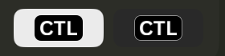

# Branding and Visual Design

How Calendar Time Logger looks, and how its artwork is produced. Decisions behind it: [ADR-019](../Decisions/ADR-019-app-icon-and-ctl-mark.md), [ADR-020](../Decisions/ADR-020-dmg-packaging.md), [ADR-014](../Decisions/ADR-014-sf-symbols-template-icons.md), [ADR-016](../Decisions/ADR-016-menu-bar-pill-and-symbol-segments.md).

## Identity

| Element | Use |
| --- | --- |
| **Calendar Time Logger** | The full product name, used in all user-facing text |
| **CTL** | The short mark: white "CTL" centered on black, from the original `logo.png`. Used for the app icon, the menu bar item, the welcome screen, and the installer |
| Black `#000000` | Icon, CTL mark plate, welcome screen header, and installer background |
| Purple → blue `#9B55EE` → `#4A7BF7` | Accent: the installer arrow and the app tint |

The app's purple accent comes from the `AccentColor` asset; macOS replaces it with the user's system accent unless that is set to Multicolor. Templates keep their own colors.

## App icon


Generated by [`scripts/generate-app-icon.swift`](../../scripts/generate-app-icon.swift):

```bash
DEVELOPER_DIR=/Applications/Xcode-beta.app/Contents/Developer swift scripts/generate-app-icon.swift
```

- **The mark is flat: a solid black body and the white "CTL" wordmark, nothing else.** No stroke, no baked shadow, no gradient, and no accent bar. macOS draws its own edge shading, as it does for every other icon. Earlier versions had a hairline edge and an accent bar; the hairline read as a border.
- **The wordmark is the original artwork.** Since 1.3.0 the generator lifts the glyphs from `logo.png` (the original CTL logo, left unchanged) as an anti-aliased mask and only ever scales them down, so the icon, the menu bar mark, the welcome screen, and the installer all show the original letterforms rather than a system font. In `logo.png` the glyphs span 84% of the square; the icon uses 70% of the full-bleed tile (72% of the rounded body) so they sit inside the system squircle, and 82% at 16 and 32 px for legibility. No installed font matches the original exactly (Arial Bold is closest, about 5% of pixels different), which is why the artwork is used directly.
- The generator also writes `CTLWordmark.imageset`: the wordmark alone, white on clear.
- **The app icon ships as `Resources/AppIcon.icns`** (`CFBundleIconFile`), built by the generator through `iconutil`, and its artwork is **full bleed**: macOS masks an `.icns` into the system squircle, so it fills the tile. An asset-catalog `AppIcon.appiconset` is instead composited onto a gray compatibility plate on macOS 26 and later — that plate is what showed as a light border around the dark icon ([ADR-024](../Decisions/ADR-024-flat-icns-app-icon.md)). Don't set `ASSETCATALOG_COMPILER_APPICON_NAME`.
- A second, **rounded** shape — an 824 px continuous-corner body inside a 1024 px canvas — is generated for the images nothing masks: `BrandLogo` and the DMG volume icon.
- Every size (16–1024 px) is rendered from the 1024 px original, downscaled with high-quality interpolation, never enlarged.
- After changing the icon, the cache only updates once the bundle is replaced, `touch`ed, and the Dock restarted.
- The script also writes the `BrandLogo` images used by About, onboarding, and the menu bar popover footer. Because those images include the icon margin, views must **not** clip them to a rounded rectangle.
- `logo.png` at the repository root is the original brand artwork and is left unchanged.

Verify with IconServices (what Finder, Dock, and Spotlight draw):

```swift
NSWorkspace.shared.icon(forFile: "/Applications/Calendar Time Logger.app")
```

## Menu bar

The CTL item is drawn by `MenuBarLabel`:

- **Idle:** the **CTL mark** (default) — the `CTLWordmark` image (23 × 10 pt) centered on a 30 × 16 pt black rounded plate, rendered at the screen's backing scale. It keeps its own colors, so it is a **non-template image**; on a dark menu bar a 0.5 pt white hairline keeps the plate defined against the background.

  

  Settings offers three alternatives: **CTL Outline** ("CTL" in an outlined rounded square with a small chevron, a **template image** that macOS tints for light, dark, and highlighted menu bars), **CTL Text**, and a clock symbol.
- **During a session:** the template's SF Symbol, name, and duration, per its display mode. Automatic colors render as template content; custom colors or a background pill render as a non-template image.
- Strokes use whole-pixel widths at 2x so the mark stays sharp.

Popover sizes live in one place, `MenuBarPopoverMetrics`:

| Value | Size |
| --- | --- |
| Width | 288 pt |
| Row inset | 10 pt (headers use the same inset, so text aligns) |
| Template icon | 32 pt |
| Utility icon column | 22 pt |
| Row corner radius | 8 pt |

Typography is semantic: `.title3.bold()` for "Ready to work", `.body` for the subtitle and utility rows, `.title3` for template names, and `.body` secondary for keyboard shortcuts. Template rows end in a chevron menu (Start Work, Start with Priority…, Edit Template…).

The popover width is fixed at 288 pt whatever it is showing. Quick New Task and per-template priority appear as inline forms in place of the template list, and the running session's priority appears as SF Symbols rather than labelled chips, so nothing forces the popover wider.

## Welcome screen


macOS apps have no launch screen, so the first-launch welcome sheet (`OnboardingView`) is the startup experience. Its header is black in both appearances, with the `CTLWordmark` 150 pt wide and the product name in white; the content below follows the system appearance.

## Installer


Generated by [`scripts/dmg/render-background.swift`](../../scripts/dmg/render-background.swift) and laid out by [`scripts/package-dmg.sh`](../../scripts/package-dmg.sh):

- 660 × 420 pt window, icons at (180, 220) and (480, 220), icon size 128.
- Black throughout, like the app icon: the original CTL wordmark (104 pt wide) and "Calendar Time Logger" at the top, the accent arrow between the icons, and the instruction in light gray at the bottom.
- **Label plates.** Finder draws file labels in dark text over a custom background whatever the system appearance, so each label ("Calendar Time Logger.app", "Applications") sits on its own light rounded plate, 28 pt tall and centered where Finder places the label on a Retina display. On a 1x display Finder sets the text a few points lower, still within the plate. Before 1.3.0 the installer used a light tray for the same reason.
- The volume icon is copied into the image after Finder lays out the window and flagged as a custom icon; the build fails if it is missing.
- Background is shipped as a 1x/2x TIFF; the volume icon is built from the app's icon PNGs with `iconutil`.

## Screenshots

[Screenshots](Screenshots) are captured from the DEBUG demo build (`-demo -demoWindowSize 1440x900`), which uses sample work data and sample calendars, so they never show real data. Since 1.3.0 they are taken with CleanShot X window capture (⌥⌘⌃W). The menu bar mark images come from the app's own previews (Settings › Menu Bar and the template editor's Menu Bar Preview), which use the same renderer as the menu bar.
