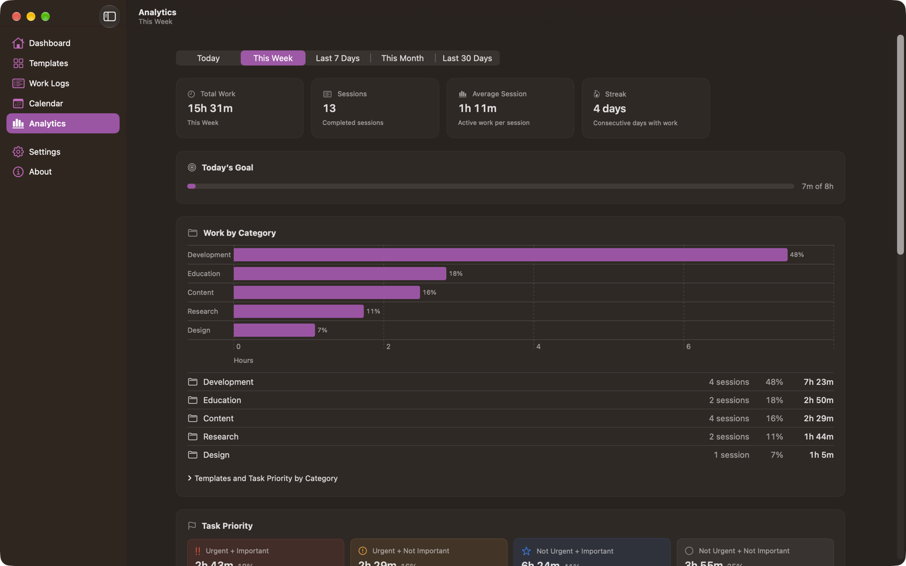

# Analytics

Analytics summarizes finished sessions. Cancelled sessions are never counted.

## The date range

One picker at the top sets the range for **every** figure on the screen:

| Range | Covers |
| --- | --- |
| **Today** | The current day |
| **This Week** | From the start of this week to the end of today |
| **Last 7 Days** | Today and the six days before it |
| **This Month** | From the first of the month to the end of today |
| **Last 30 Days** | Today and the 29 days before it |

## How the numbers are counted

- Every total is **active work** — time with pauses subtracted.
- A session counts toward the day it **started**. Work that crosses midnight is not split.
- The week and month are your locale's, as macOS defines them.

## Tiles

| Tile | Shows |
| --- | --- |
| **Total Work** | Active work in the selected range |
| **Sessions** | Completed sessions in the range |
| **Average Session** | Total work divided by the number of sessions, or `—` when there are none |
| **Streak** | Consecutive days with at least one session |

The streak counts back from today whatever the range is. If you have not recorded anything yet today, it counts back from yesterday instead, so a day still in progress does not reset it. A day with no work ends the streak.

**Today's Goal** shows today's active work against the daily goal from **Settings › General**. It is always about today, and is hidden when the goal is off.

## Work by Category

A horizontal bar chart with one bar per category, longest first, labelled with its share of the range. Under it, each category is listed with its number of sessions, its share as a percentage, and its active work. The shares add up to 100%.

**Templates and Task Priority by Category** expands into a card per category that lists:

- the templates (and quick tasks) recorded in that category, with their time, and
- the task priority combinations used in that category, with their time. Combinations with no work in that category are left out to keep the card short.

Categories are counted **as recorded**: each session counts toward the category it had when it was recorded (or was last edited to), not the category its template has today. If you rename a category, work before and after the rename appears as two rows. Names that differ only in capitalization are one category.

With no work in the range, the section shows **No category data yet** instead of an empty chart. See [Categories](Categories.md).

## Task Priority

Four cards, one for each combination of Urgent and Important, each with the time, its share of the range, and the number of sessions. A bar chart below them compares the four directly. All four are always shown, at zero when unused.

Under the chart, two totals count the work that was **urgent** at all and the work that was **important** at all. These overlap — a session that was both is counted in each — and the screen says so. The four combinations above do not overlap and add up to the total.

**By Template** expands into a row per template with its urgent time, its important time, and its total, so you can see which kind of work each template actually produced.

With no work in the range, the section shows **No Priority Data** rather than empty charts.

See [Task Priority](Task%20Priority.md) for where the values come from.

## Work by Template

A horizontal bar chart in hours, one bar per template, longest first, each in that template's color with its total at the end.

Under the chart, the same templates are listed with their session count, their share of the range as a percentage, and their total.

Templates are grouped by identity, so a renamed template keeps its history together and shows its current name. Work recorded under a template you have since deleted is grouped by the name it had.

## Daily Active Work

A stacked bar per day, split by template, in hours, across the selected range. Days with no work appear as gaps, so a week off is visible rather than hidden. The chart is hidden for **Today**, which has no trend to draw.

## Before you have data

Until you finish your first session, Analytics shows **No Data Yet**. The tiles still appear, at zero.

## Related

- The Dashboard's [Today's Progress](Dashboard.md#todays-progress) ring shows the same per-template split for today, against your daily goal.
- The Excel export's optional **Summary** sheet has the same kinds of totals in a spreadsheet, including work by category, work by task priority, and weekly totals. See [Exporting Data](Exporting%20Data.md).

## Limits

Analytics loads every completed session into memory to calculate its totals. With a very large history this can be slow.

---

[Back to User Guide](README.md) · [Previous: Calendar](Calendar.md) · [Next: Notifications](Notifications.md)
