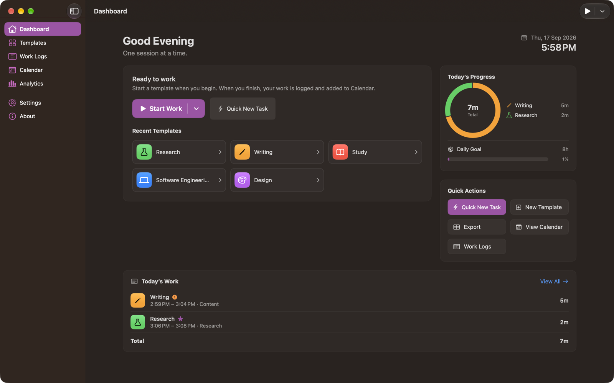
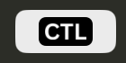

# App Overview

Calendar Time Logger has three surfaces: the **main window**, the **CTL menu bar item**, and the **Settings window**. All three act on the same data.

## The main window

A sidebar on the left, the selected section on the right, and a live session indicator pinned to the bottom of the sidebar while you are working.

### Sidebar sections

| Section | Shortcut | Purpose | Page |
| --- | --- | --- | --- |
| Dashboard | <kbd>⌘</kbd><kbd>1</kbd> | The current session, today's progress, and today's work | [Dashboard](Dashboard.md) |
| Templates | <kbd>⌘</kbd><kbd>2</kbd> | Create and edit the kinds of work you record | [Templates](Templates.md) |
| Work Logs | <kbd>⌘</kbd><kbd>3</kbd> | Every completed session, grouped by day | [Work Logs](Work%20Logs.md) |
| Calendar | <kbd>⌘</kbd><kbd>4</kbd> | Permission, calendar choices, and sync problems | [Calendar](Calendar.md) |
| Analytics | <kbd>⌘</kbd><kbd>5</kbd> | Totals, per-template breakdown, and daily charts | [Analytics](Analytics.md) |
| Settings | — | Every preference, by pane | [Settings](Settings.md) |
| About | — | Version and what the app promises about your data | — |

The **Calendar** row shows a badge with the number of completed sessions whose Calendar event failed or went missing.

Clicking a row, the arrow keys, and <kbd>⌘</kbd><kbd>1</kbd>–<kbd>⌘</kbd><kbd>5</kbd> all move the selection and the content together.

### The session indicator

While a session is open, the bottom of the sidebar shows the template, a green dot (or a pause symbol), and the running active time. Clicking it returns to the Dashboard.

### Closing the window

Closing the main window does **not** quit Calendar Time Logger. The app keeps running with its CTL menu bar item, and your session keeps running with it. Quit from the menu bar popover, or with <kbd>⌘</kbd><kbd>Q</kbd>.

## The menu bar

The **CTL** item is in the menu bar whenever Calendar Time Logger is running, and disappears when it quits.

| State | What the item shows |
| --- | --- |
| Idle |  |
| Working |  |
| Paused | The same, with a `pause.fill` symbol in front |

Clicking it opens a popover with the whole session lifecycle, today's total, and links into the app. See [Menu Bar](Menu%20Bar.md).

## The menus

| Menu | Contents |
| --- | --- |
| **File** | **Export Work Logs…** (<kbd>⇧</kbd><kbd>⌘</kbd><kbd>E</kbd>) |
| **Session** | **Start Work** (a submenu of templates; <kbd>⌃</kbd><kbd>⌘</kbd><kbd>1</kbd>–<kbd>9</kbd> for the first nine), **Pause** / **Resume** (<kbd>⌥</kbd><kbd>⌘</kbd><kbd>P</kbd>), **Finish Work** (<kbd>⌥</kbd><kbd>⌘</kbd><kbd>F</kbd>), **Change Template**, **Cancel Session…** (asks first) |
| **View** | The five work sections, <kbd>⌘</kbd><kbd>1</kbd>–<kbd>⌘</kbd><kbd>5</kbd> |

Items that don't apply are disabled: **Start Work** while a session is open, **Pause** and **Finish Work** while none is.

## Shortcuts actions

Three App Intents are available to the Shortcuts app and Spotlight:

| Action | Behavior |
| --- | --- |
| **Start Work** | Starts a session from a template you pick as a parameter |
| **Pause or Resume Work** | Pauses the running session, or resumes it if it is paused |
| **Finish Work** | Finishes the session, saves it, and adds it to Calendar |

## Appearance

**Settings › Appearance** sets light, dark, or system appearance, an accent color, and a comfortable or compact layout density. The screenshots in this guide use dark appearance.

---

[Back to User Guide](README.md) · [Previous: Getting Started](Getting%20Started.md) · [Next: Sessions](Sessions.md)
