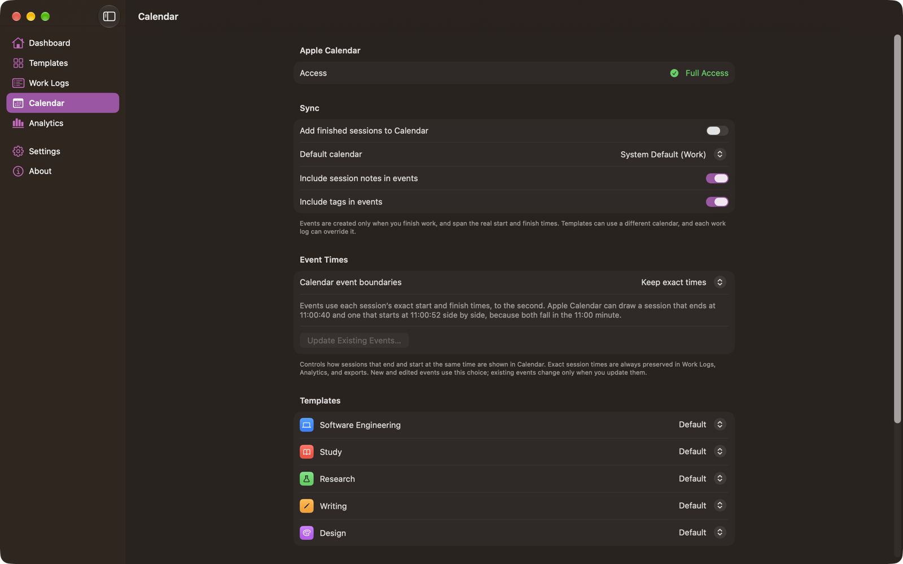
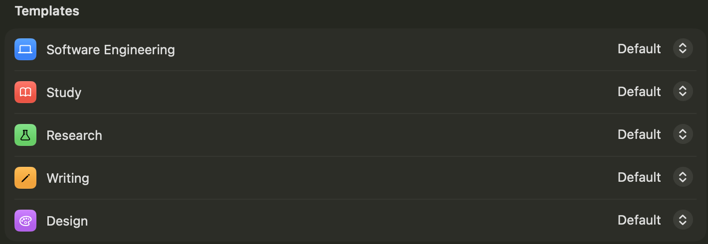

# Calendar

Calendar Time Logger writes each **finished** session to Apple Calendar. The session is the record; the event is a copy of it.



The **Calendar** section in the sidebar shows whether the app has access, the sync options, which calendar each template writes to, the calendars you can choose from, and any sessions whose sync needs attention.

## What determines an event's times

| Part of the event | Comes from |
| --- | --- |
| **Start** | The moment you chose Start Work |
| **End** | The moment you chose Finish Work |
| **Duration** | The wall-clock span between them, pauses included |
| **Title** | The template's name |

A template has no duration and cannot set one. An event is always as long as the work actually took.

```
9:00 AM   Start "Software Engineering"   → timer runs, nothing in Calendar
10:15 AM  Pause                           → paused time recorded
10:40 AM  Resume
11:15 AM  Finish Work                     → work log saved → event 9:00–11:15 AM
```

The event spans 9:00–11:15 (2h 15m). The notes record that 1h 50m of that was active work and 25m was paused.

### Sessions that end and start at the same time

A session that ends at 11:00 and the next one that starts at 11:00 are **back to back, not overlapping**: the end of one session is the start of the next. Calendar Time Logger never adds or removes a minute to separate them, and never changes a work log's recorded times to make Calendar look tidier.

Recorded times include seconds. A session you finish at 11:00:40 and the next one you start at 11:00:52 don't overlap, but both events fall inside the 11:00 minute, so Apple Calendar can draw them side by side. **Settings › Calendar › Event Times** controls this:

| Calendar event boundaries | What Calendar events use |
| --- | --- |
| **Keep exact times** (default) | Each session's exact start and finish, to the second |
| **Round to the nearest minute** | Start and finish each rounded to the nearest minute, so back-to-back sessions stack cleanly. Only the event is rounded: Work Logs, Analytics, and exports keep the exact times. A session shorter than half a minute keeps its exact times. |

Rounding can never make two sessions overlap in Calendar that don't overlap in Work Logs.

The setting applies to events created or updated after you change it. **Update Existing Events…** applies it to events Calendar Time Logger already created: after you confirm, it changes only its own events that still exist and whose times differ. Work logs aren't changed, deleted events aren't recreated, your other events are never touched, and running it again changes nothing.

Editing times in **Edit Entry** stores whole minutes for a time you change, so choosing 11:00 means 11:00:00, not 11:00 plus the seconds the entry had before. If the new times overlap another work log, the sheet names it; you can still save. See [Work Logs](Work%20Logs.md#editing-a-session).

## Permission

Calendar Time Logger needs **Full Access** to your calendars.


Full access is required because "Add Events Only" cannot list your calendars for you to choose from, and cannot update an event the app created earlier. If you grant only that, the app says so and asks for full access.

| Status | What the Calendar section offers |
| --- | --- |
| **Not Requested** | **Connect Apple Calendar**, which shows the system prompt |
| **Full Access** | Nothing further |
| **Off** or **Add Events Only** | **Open Privacy & Security Settings** |
| **Restricted** | An explanation that a device management profile is blocking it |

If you never grant access, sessions are still recorded in full. Each one is marked **Sync Failed** with an explanation and a retry path.

With full access, Calendar Time Logger **reads** events only to find its own — by looking for its ownership link near each session's time. Nothing it reads from your calendars leaves the app.

## Choosing a calendar

Four levels, most specific first:

```
this session's own calendar
   └─ falls back to the template's calendar
        └─ falls back to Settings › Calendar › Default calendar
             └─ falls back to your system default calendar
```

| Where to set it | Applies to |
| --- | --- |
| **Calendar › Default calendar** | Everything that has no more specific choice |
| The **Templates** list in the Calendar section, or **Recording › Calendar** in the template editor | Every session from that template |
| **Edit Entry › Calendar** in Work Logs | That one session |



Only calendars you can write to are offered. **Available Calendars** lists every calendar the app can see, with its account and a **Read-only** marker where relevant.

Changing a template's calendar does **not** move events that already exist.

## Sync settings

| Setting | Effect |
| --- | --- |
| **Add finished sessions to Calendar** | Off means no events are created at all. Sessions are still recorded; the completion confirmation says "Calendar sync is off, so no event was created." Existing events are left alone. |
| **Include session notes in events** | Adds your notes to the event's notes |
| **Include tags in events** | Adds the session's tags to the event's notes |

## What an event contains

| Field | Content |
| --- | --- |
| **Title** | The template name |
| **Start / End** | The real start and finish times, or rounded to the nearest minute if you chose that under **Event Times** |
| **Notes** | "Recorded with Calendar Time Logger", the template name, active work, and paused time when it is a minute or more; then tags and your notes, if those settings are on |
| **URL** | `calendartimelogger://session/<id>` |

A typical event's notes:

```
Recorded with Calendar Time Logger

Template: Software Engineering
Active work: 1h 50m
Paused: 25m

Tags: #coding #development

Notes:
[10:12] Fixed the timer drift bug
```

Clicking the event's URL in Calendar opens Calendar Time Logger at that work log.

### Ownership

The URL is how the app recognizes its own events. **Only events carrying that link are ever updated or removed.** An event you created yourself, or one another app created, is never touched — even if it looks identical. If the app finds that an event it expected is not its own, it leaves it alone and creates a new one instead.

If Calendar changes an event's internal identifier, the app finds the event again by its ownership link within a day either side of the session, so you do not end up with duplicates.

## Event colors

Apple Calendar colors every event by the calendar it belongs to. EventKit provides no per-event color, so **a template cannot give its events their own color**.

To make a kind of work stand out in Calendar, point its template at a calendar that already has the color you want. The template editor's **Calendar Event Appearance** card shows which color the events will be, and **Match Icon Color to Calendar** copies that color to the template's icon so the app and Calendar agree. See [ADR-017](../Decisions/ADR-017-calendar-event-color-limitation.md).

## When sync fails

The work log is saved before Calendar is touched, so a Calendar failure never costs you a record.

| Problem | What you see | What to do |
| --- | --- | --- |
| Access denied or restricted | Sync Failed, naming the permission | Allow full access in System Settings › Privacy & Security › Calendars, then Retry |
| "Add Events Only" granted | Sync Failed, explaining the limitation | Change it to full access, then Retry |
| The chosen calendar was deleted | "The selected calendar no longer exists." | Choose another calendar for the template or in Settings, then Retry |
| The chosen calendar is read-only | "The calendar *name* is read-only." | Choose a calendar you can edit, then Retry |
| Saving the event failed | Sync Failed with the reason | Retry |
| Sync is turned off | Not in Calendar | Turn on **Add finished sessions to Calendar**, then **Add to Calendar** on the work log |

There is no silent fallback to a different calendar: if the calendar you chose cannot be used, the app says so rather than putting your work somewhere unexpected.

### Sync Issues

The Calendar section's **Sync Issues** lists every completed session that failed or whose event went missing, with the reason, a **Show** button that opens the work log, and **Retry All**. When everything is fine it says so.

The Dashboard shows a banner and the sidebar's Calendar row shows a badge while any session needs attention.

### Events deleted in Calendar

If you delete one of the app's events in Calendar, the work log is marked **Event Missing** and its note says the event was removed outside Calendar Time Logger and the work log is unchanged. You can re-add it with **Add to Calendar**.

This check runs at launch and whenever Calendar reports a change, over the 500 most recently completed sessions.

## Turning Calendar off entirely

Turn off **Add finished sessions to Calendar**, or never grant access. Calendar Time Logger then works as a pure local time tracker: sessions, Work Logs, analytics, and Excel export all behave the same. Events already in Calendar stay there.

---

[Back to User Guide](README.md) · [Previous: Work Logs](Work%20Logs.md) · [Next: Analytics](Analytics.md)
