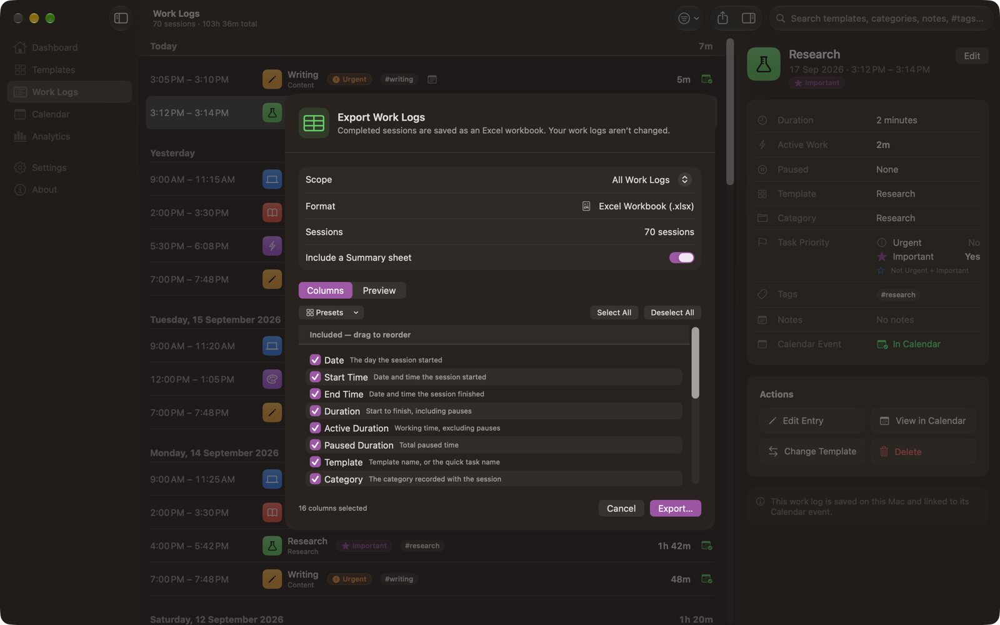

# Exporting Data

Calendar Time Logger exports completed sessions as an **Excel workbook** (`.xlsx`). That is the only export format; there is no CSV, JSON, or PDF export.

Exporting only reads your work logs. It never changes or deletes them.

## Starting an export

Any of these opens the export sheet:

- **File › Export Work Logs…** (<kbd>⇧</kbd><kbd>⌘</kbd><kbd>E</kbd>)
- The **Export** button in the Work Logs toolbar
- The Dashboard's **Export** quick action
- **Settings › Export › Export Work Logs…**

## Choosing what to export

| Scope | Includes |
| --- | --- |
| **All Work Logs** | Every completed session |
| **Current Filter** | Whatever the Work Logs list is showing right now |
| **Today** | Sessions that started today |
| **This Week** | Sessions that started this week |
| **This Month** | Sessions that started this month |

**Current Filter** appears only while a search or filter is active in Work Logs, and it names the filter, for example `Current Filter (This Week, Software Engineering)`. Starting the export from Work Logs preselects it.

The sheet shows how many sessions the chosen scope covers before you commit. Exporting an empty scope produces a workbook with column headers and no rows, and says so.

Open and cancelled sessions are never exported.

## Choosing the columns

The **Columns** tab lists all 17 columns the export can contain. Checked columns are exported, in the order shown; drag them to change that order. The workbook's columns run left to right in exactly that order.

| Control | What it does |
| --- | --- |
| **Presets** | **Basic** (date, template, active work), **Detailed** (times, durations, template, category, priority, tags, notes), **Priority Analysis** (date, template, active work, Urgent, Important), **Category Analysis** (date, template, category, duration, Urgent, Important), **Everything**, or **Default Columns** |
| **Select All** / **Deselect All** | Check or uncheck everything |
| Drag | Reorders the included columns |

The **Preview** tab shows the last few sessions with exactly the columns you chose, formatted as the app displays them, so you can see the shape of the sheet before saving.

**Export…** stays disabled while no column is selected; the sheet says so rather than writing an empty file.

Your selection and its order are remembered for the next export. **Settings › Export** shows how many columns are selected and can reset them to the default.

## Saving the file

**Export…** builds the workbook first, then shows the macOS Save panel. A problem with the data is therefore reported before you are asked where to put the file.

The suggested name is dated in your own time zone, for example `Work Logs 2026-09-16.xlsx`, with the scope appended for anything but All Work Logs. An `.xlsx` extension is added if you remove it. Cancelling the Save panel writes nothing and leaves the sheet open.

The file is written atomically, so a failed export never leaves a half-written file behind. When it succeeds, a confirmation names the file and offers **Show in Finder**.

Calendar Time Logger is sandboxed and can write only to the location you pick in the Save panel.

## The Work Logs sheet

One row per completed session, oldest first.

| Column | Contents |
| --- | --- |
| Date | The day the session started |
| Start Time | Real start, date and time |
| End Time | Real finish, date and time |
| Duration | Wall clock, start to finish |
| Active Duration | Duration minus paused time |
| Paused Duration | Total paused time |
| Template | Template name recorded with the session, or the quick task's name |
| Category | The category recorded with the session (see [Categories](Categories.md)) |
| Urgent | Yes or No |
| Important | Yes or No |
| Tags | The session's tags |
| Notes | The session's notes |
| Calendar | The calendar the event is in |
| Calendar Event Status | Not in Calendar, In Calendar, Sync Failed, or Event Missing |
| Calendar Event Identifier | The event's identifier in Calendar, when it has one |
| Session Status | Completed |

One more column is available but off by default:

| Column | Contents |
| --- | --- |
| Task Priority | The combination in words, for example `Urgent + Not Important` |

Dates, times, and durations are written as real Excel values, not text, so they sort and calculate correctly. Durations use an elapsed-time format, so a session longer than 24 hours still reads correctly instead of wrapping.

The header row is frozen and has a filter, so the sheet is usable as soon as it opens.

Internal database identifiers are deliberately not exported.

## The Summary sheet

Optional, and on by default. Toggle it in the export sheet or in **Settings › Export**.

| Block | Contents |
| --- | --- |
| Header | Scope, when it was exported, and the number of sessions |
| **Totals** | Total work, total active work, total paused time |
| **Work by Template** | Sessions, active work, and share of the total, per template |
| **Work by Category** | Sessions, active work, and share of the total, per category as recorded |
| **Work by Task Priority** | Sessions, active work, and share for each of the four combinations, then overlapping totals for urgent work and for important work |
| **Daily Totals** | Sessions, total work, and active work, per day |
| **Weekly Totals** | The same, per week, labeled by the week's start date |

Sessions count toward the day and week they started in, matching the rest of the app.

## Export defaults

**Settings › Export** sets the scope and the Summary option a new export starts with, whether the file is revealed in Finder afterwards, and how many columns are currently selected (with a **Reset** button). Your last successful choice is remembered.

## If an export fails

| Problem | Message | What to do |
| --- | --- | --- |
| No permission for the location | "Calendar Time Logger doesn't have permission to save *file*." | Choose a different folder, such as Documents or Desktop |
| Disk full | "There isn't enough disk space to save the export." | Free up space and try again |
| Other write failure | "The Excel workbook couldn't be saved." | The reason is shown; your work logs are unchanged |
| Data could not be encoded | "The work logs couldn't be converted to an Excel workbook." | Reported before the Save panel; nothing is written |
| No columns selected | "No columns are selected, so there is nothing to export." | Check at least one column |

In every case the export sheet stays open and your work logs are untouched.

---

[Back to User Guide](README.md) · [Previous: Notifications](Notifications.md) · [Next: Settings](Settings.md)
