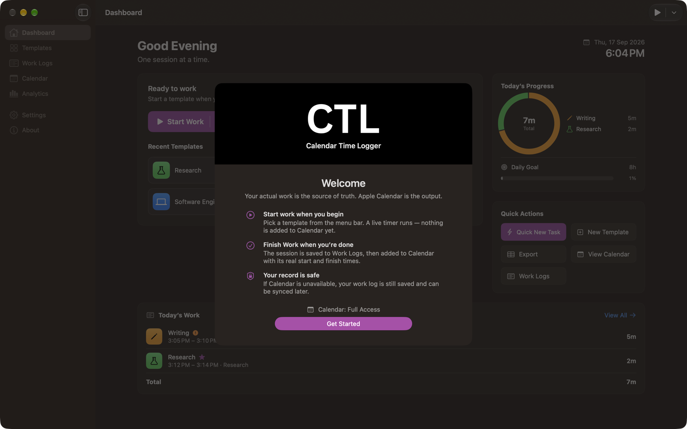
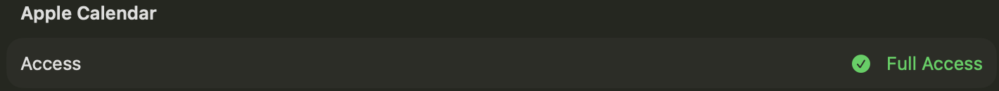

# Getting Started

This page takes you from an empty Mac to your first Calendar event.

## Requirements

| Requirement | Detail |
| --- | --- |
| macOS | 27.0 or later |
| Calendar access | Full Access, and only if you want Calendar events |
| Notifications | Optional |
| Network | None. Calendar Time Logger is sandboxed without the network entitlement. |

## 1. Install

1. Download `Calendar-Time-Logger-v1.4.0.dmg` from the [latest release on GitHub](https://github.com/abarman152/calendar-time-logger/releases/latest) and open it. The installer window shows the CTL mark, the app, and your Applications folder.
2. Drag **Calendar Time Logger** onto **Applications**.
3. Eject the disk image (drag it to the Trash, or choose **Eject** in Finder's sidebar).
4. Open Calendar Time Logger from Applications or Spotlight.

**If macOS won't open it.** Builds are signed with a personal Apple Development certificate and are not notarized. On the Mac that built them they open normally. On another Mac, macOS refuses the first launch because it can't verify the developer: dismiss the warning, open **System Settings › Privacy & Security**, and click **Open Anyway** beside the message about Calendar Time Logger. Do this only for a copy from a source you trust.

**Upgrading.** Installing over an older version keeps all your templates and work logs. Upgrading from 1.2 gives existing ones the category **General**, and 1.4.0 builds its stored category list from your templates (see [Categories](Categories.md)); an older version can't open the data afterwards.

To build the app or the disk image yourself, see the [README](../../README.md#option-2-build-from-source) and [Building](../Development/DEVELOPMENT.md#release-packaging).

## 2. The welcome screen

The first time the main window opens, Calendar Time Logger shows its welcome screen. The black header carries the CTL mark and the product name; below it, the screen explains how the app works and offers the two permissions it can use.

- **Connect Apple Calendar** asks macOS for Calendar access. You can skip this and grant it later.
- **Allow Notifications** asks for notification permission. This is optional.
- **Get Started** closes the welcome screen.

You can bring it back from **Settings › General › Show Welcome Screen Again**.

## 3. Calendar permission

Calendar Time Logger needs **Full Access** to your calendars. "Add Events Only" is not enough, because the app has to list your calendars so you can choose one, and it has to find its own events again in order to update them.

If you skip the prompt, the app asks the first time you finish a session, when the request has obvious context. You can also grant it from the **Calendar** section at any time.

If you never grant access, nothing is lost: sessions are still recorded, and each one is marked **Sync Failed** with a retry button. See [Calendar](Calendar.md).

## 4. Your templates

Five templates are created on first launch:

| Template | Category | Icon (SF Symbol) | Color | Tags |
| --- | --- | --- | --- | --- |
| Software Engineering | Development | `laptopcomputer` | Blue | `#coding`, `#development` |
| Study | Education | `book` | Red | `#learning` |
| Research | Research | `flask` | Green | `#research` |
| Writing | Content | `pencil` | Orange | `#writing` |
| Design | Design | `paintpalette` | Purple | `#design` |

Every template has a category, which groups your work in Work Logs and Analytics; see [Categories](Categories.md). They are ordinary templates: rename them, change their icons, delete the ones you don't need, or add your own. Deleting them does not bring them back on the next launch. See [Templates](Templates.md).

## 5. Start work

Choose a template in any of these places:

- The **CTL** menu bar item, where every template is one click from starting.
- The Dashboard's **Start Work** button, or a card under **Recent Templates**.
- **Session › Start Work**, or <kbd>⌃</kbd><kbd>⌘</kbd><kbd>1</kbd>–<kbd>9</kbd> for the first nine templates.
- The Shortcuts action **Start Work**.

The timer begins immediately and the session is saved. **Nothing is added to Apple Calendar yet.**

## 6. Pause, resume, and take notes

- **Pause** stops the active-time timer without ending the session; **Resume** continues it. Paused time is recorded separately and excluded from active work.
- **Add Note** appends a timestamped line, for example `[10:12] Fixed the timer drift bug`, to the session's notes.
- **Change Template** moves the running session to a different template without resetting the timer.

## 7. Finish work

Choose **Finish Work** (<kbd>⌥</kbd><kbd>⌘</kbd><kbd>F</kbd>, the Dashboard button, or the menu bar popover). In this order, Calendar Time Logger:

1. Records the finish time and saves the session.
2. Attempts to write a Calendar event covering the real start and finish times.
3. Shows the **Work Completed** confirmation.

The confirmation shows the time range, total duration, active work, paused time, and what happened in Calendar. Anything you type into **Notes** here is saved to the session, and to its Calendar event if one exists.

## 8. Review it

**View in Work Logs** (or the Work Logs section) shows the finished session grouped under its day, with its durations, tags, notes, and Calendar status.

## Where to go next

- [Sessions](Sessions.md) for the full lifecycle, including Cancel Session and recovery after a crash.
- [Templates](Templates.md) to set up templates for the work you actually do.
- [Menu Bar](Menu%20Bar.md) to work without opening the main window.
- [Calendar](Calendar.md) to choose which calendar each kind of work goes to.

---

[Back to User Guide](README.md) · [Next: App Overview](App%20Overview.md)
