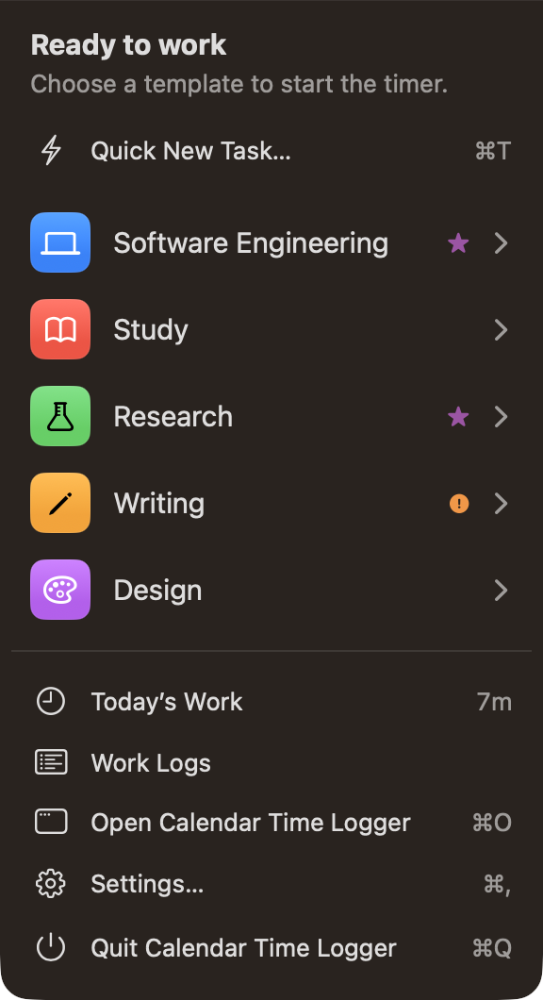
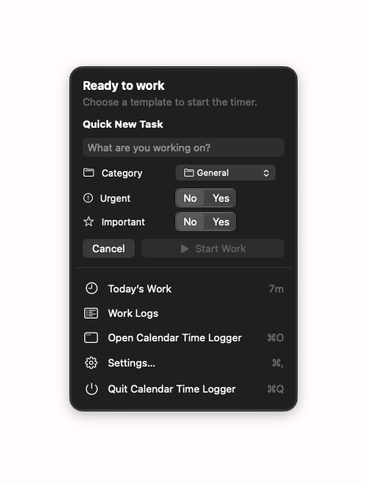

# Menu Bar

Calendar Time Logger puts one item in the macOS menu bar, called the **CTL item**. You can run a whole day of work from it without opening the main window.

> Everything here applies to Calendar Time Logger's own menu bar item, not to the macOS menu bar as a whole.

## The CTL item is always there

```
App launches   →  CTL
Session starts →  [icon] Software Engineering · 02:04:10
Pause          →  [pause] [icon] Software Engineering · 02:00:39
Finish/Cancel  →  CTL
App quits      →  the item is removed
```

The item appears when the app starts and disappears when it quits — not when a session starts and stops. It is how you know Calendar Time Logger is running, and it is always one click from starting work.

Because a second copy of the app would put a second item in the menu bar and write to the same database, launching Calendar Time Logger again simply brings the running copy forward and quits.

## Idle


**Settings › Menu Bar › When not working, show** chooses between:

| Style | Appearance |
| --- | --- |
| **CTL Mark** (default) | The white "CTL" wordmark from the app icon, centered on a black rounded plate |
| **CTL Outline** | "CTL" in an outlined rounded square with a small chevron |
| **CTL Text** | "CTL" as plain menu bar text |
| **Clock Symbol** | The `clock` SF Symbol |


The CTL Mark keeps its own black and white, with a hairline that keeps it defined on a dark menu bar. The other three are drawn so macOS tints them for light, dark, and highlighted menu bars. The Settings pane previews the choice on both a light and a dark strip.

**Show CTL in the menu bar** turns the item off entirely. With it off, use the main window or the Session menu — nothing else changes.

## During a session


The item shows the running template according to that template's own settings: its display mode, its colors, and its optional background pill. Edit them in the template editor — see [Templates](Templates.md#menu-bar-preview-and-settings).

| Display mode | Shows |
| --- | --- |
| Icon Only | The template's SF Symbol |
| Name Only | The name, optionally with the icon |
| Duration Only | The running active time |
| Icon + Duration | Symbol and time |
| Name + Duration | Name, separator, time |
| Icon + Name + Duration | All three |

**Settings › Menu Bar › Show seconds in the duration** switches between `02:04:10` and `02:04`.

The duration shown is **active work** — paused time is excluded.

### Paused

A paused session adds the `pause.fill` symbol at the front. State is never signalled by color alone, so it stays readable however you have styled the item.

### Templates that hide themselves

If a template has **Show in menu bar** turned off, the item shows a generic timer symbol while that template runs (and a pause symbol when paused). The menu bar still tells you a session is going, without naming it.

## The popover

Click the CTL item to open it.

### When you are not working



**Ready to work** is followed by **Quick New Task…** (<kbd>⌘</kbd><kbd>T</kbd>) and up to nine templates. Clicking a template row starts it immediately, with that template's own task priority; a row shows small symbols for the values it sets. The chevron at the end of a row opens a small menu with **Start Work**, **Start with Priority…**, and **Edit Template…**.

**Quick New Task…** and **Start with Category and Priority…** replace the list with a compact form inside the popover — a name where one is needed, a **Category** menu, the two priority controls, and **Start Work**. **Cancel** returns to the list. The popover does not get wider.



If you have no templates, the popover offers **Create a Template…** alongside Quick New Task.

### When you are working


| Row | Action |
| --- | --- |
| Header | Template icon and name, the session's category, the Urgent and Important symbols, a tag, and a **Working** or **Paused** badge |
| Timer | Active work, with the start time under it |
| **Pause** / **Resume** | Stops or continues the timer |
| **Finish Work** | Ends the session, saves it, then adds it to Calendar |
| **Change Template** | Moves the session to another template, keeping its timing |
| **Change Category and Priority** | Shows the Category menu and the Urgent and Important controls inline; changes apply immediately to this session only |
| **Add Note** <kbd>⌘</kbd><kbd>N</kbd> | Opens a field for a timestamped note |
| **Cancel Session…** | Discards the session, after a confirmation |

### Always available

| Row | Action |
| --- | --- |
| **Today's Work** | Shows today's total; click to expand a per-template breakdown |
| **Work Logs** | Opens the main window at Work Logs |
| **Open Calendar Time Logger** <kbd>⌘</kbd><kbd>O</kbd> | Opens and activates the main window |
| **Settings…** <kbd>⌘</kbd><kbd>,</kbd> | Opens the Settings window |
| **Quit Calendar Time Logger** <kbd>⌘</kbd><kbd>Q</kbd> | Quits the app and removes the CTL item |

The footer shows the app icon, the name, and the version, with a **Show App** button.

### After finishing from the menu bar

Finishing a session in the popover replaces its contents with a compact **Work Completed** card: the template, its priority chips, the time range, active work, the Calendar result, and **Done**. If an event was created, **View in Calendar** opens the Calendar app.

The popover is also where **Active Session Detected** appears after a crash, with **Resume Session**, **Finish Work**, and **Cancel Session**.

---

[Back to User Guide](README.md) · [Previous: Templates](Templates.md) · [Next: Work Logs](Work%20Logs.md)
