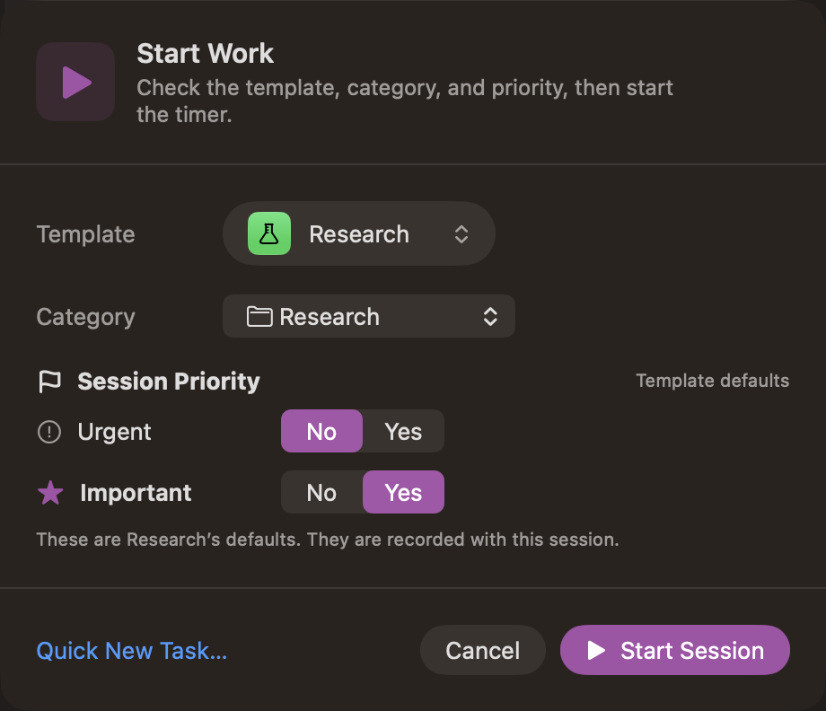
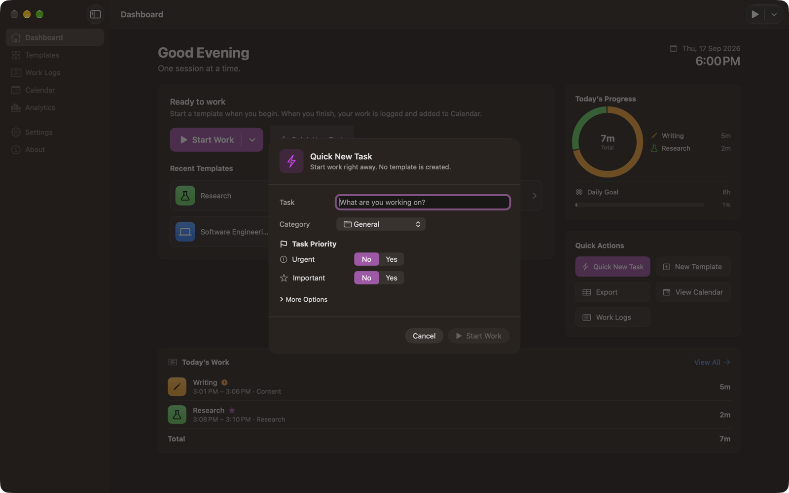
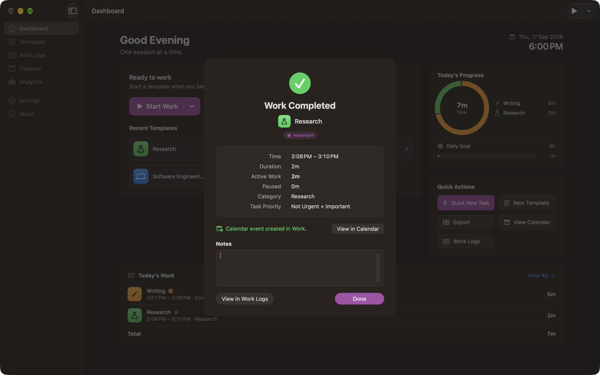

# Sessions

A **session** is one stretch of recorded work. It is the thing Calendar Time Logger actually stores; a Work Log is the finished session as you see it, and a Calendar event is a copy written afterwards.

## The lifecycle

```
              Start Work
    idle ──────────────────▶ active ◀────── Resume ─────┐
                              │ │                       │
                              │ └──────── Pause ───────▶ paused
                              │                          │
                   Finish Work│              Finish Work │
                   Cancel     │              Cancel      │
                              ▼                          ▼
                    completed  /  cancelled   (final, no further changes)
```

Only these moves are possible. The app refuses anything else rather than guessing — you cannot pause a session that is already paused, or finish one that has already ended.

| State | Meaning |
| --- | --- |
| **Working** | The timer is running and active time is accumulating. |
| **Paused** | The session is open, but the time being spent is counted as paused, not active. |
| **Completed** | Finished. It appears in Work Logs and analytics, and gets a Calendar event. |
| **Cancelled** | Discarded. It never appears in Work Logs, analytics, or Calendar. |

**One session at a time.** Finish or cancel the open session before starting another. If you started the wrong one, use **Change Template** instead — it keeps the timer running.

## Start Work

**Start Work** on the Dashboard, the toolbar's **New Session**, and **Session › Start Work…** (<kbd>⌥</kbd><kbd>⌘</kbd><kbd>S</kbd>) open a sheet showing the template, its category, and its task priority before the timer starts.



Pick the template, change the category or priority for this session if you need to, and choose **Start Session**. The footnote tells you whether the values are the template's defaults or changed for this session only. Choosing a template directly — from that sheet's menu, a **Recent Templates** tile, **Session › Start Template** (<kbd>⌃</kbd><kbd>⌘</kbd><kbd>1</kbd>–<kbd>9</kbd>), a template row in the menu bar popover, a template's **Start Work** button in the editor, or the Shortcuts action — starts immediately with that template's own values.

**Quick New Task** (<kbd>⌥</kbd><kbd>⌘</kbd><kbd>N</kbd>) starts a session without a template: you name the work and set its category and priority.



**Start Work** stays disabled until the task has a name. **More Options** adds tags, notes, and a calendar for this one session. See [Task Priority](Task%20Priority.md#quick-new-task).

When a session starts:

- The start time is recorded and the session is saved immediately.
- The template's name, icon, color, tags, category, and task priority are copied onto the session, so renaming, editing, or deleting the template later never changes recorded work.
- **Nothing is written to Apple Calendar.**

## Pause and Resume


**Pause** (<kbd>⌥</kbd><kbd>⌘</kbd><kbd>P</kbd>) records the moment you stepped away. **Resume** records the moment you came back. A session can be paused and resumed as often as you like.

Two durations are kept, and both are visible on the Dashboard while you work:

| Duration | Meaning |
| --- | --- |
| **Active work** | Time spent working, with every pause subtracted. This is what the timer shows, what totals and analytics use, and what the daily goal measures. |
| **Wall clock** | Start to finish, pauses included. This is the span a Calendar event covers. |

Both are calculated from timestamps, not from a counter that ticks. Durations therefore stay correct across sleep, quitting the app, and a Mac that was busy enough to skip a UI update.

Long-session reminders count active time only, so a pause does not push a reminder forward. See [Notifications](Notifications.md).

### Sleeping Macs

**Settings › General › Pause the session when my Mac sleeps** is off by default, because you may still be working away from your Mac. With it on, the session pauses when the Mac sleeps and the Dashboard tells you so when you come back.

## Finish Work

**Finish Work** (<kbd>⌥</kbd><kbd>⌘</kbd><kbd>F</kbd>) ends the session. In order:

1. Any open pause is closed, the finish time is recorded, and **the session is saved**.
2. Calendar sync runs, if it is on and access has been granted.
3. The **Work Completed** confirmation appears.

Saving first is deliberate: a Calendar problem can never cost you the record of your work.

### The Work Completed confirmation



| Field | Meaning |
| --- | --- |
| **Time** | Real start and finish times |
| **Duration** | Wall clock, start to finish |
| **Active Work** | Duration minus paused time |
| **Paused** | Total paused time, `0m` if you never paused |
| **Task Priority** | The combination the session ended with |
| Calendar status | **Calendar event created in *calendar*.**, **Calendar sync is off, so no event was created.**, or the failure with a **Retry** button |
| **Notes** | Anything you type is saved to the session, and to its Calendar event if there is one |

**View in Work Logs** opens the session in Work Logs. **Done** closes the confirmation.

Finishing from the menu bar shows a compact version of the same confirmation inside the popover.

## Cancel Session

**Cancel Session** discards the session. It is on the Dashboard, in the menu bar popover, and in the **Session** menu, and each asks first. The confirmation says plainly what will happen: the timer stops and the session will not appear in Work Logs, analytics, or Calendar. In the Session menu's confirmation, **Keep Working** is the default button, so pressing <kbd>Return</kbd> never discards the session.

| | Finish Work | Cancel Session |
| --- | --- | --- |
| Appears in Work Logs | Yes | No |
| Counted in totals and analytics | Yes | No |
| Calendar event | Created | Never |
| Reversible | It can be edited or deleted afterwards | No |

Cancelled sessions are kept in the database but are not shown anywhere and cannot be restored through the interface.

## Change Category and Priority

**Change Category and Priority** changes the open session's category and its Urgent and Important values. The template is not edited. The Work Log records the values the session ends with. See [Categories](Categories.md) and [Task Priority](Task%20Priority.md).

## Change Template

**Change Template** moves an open session to another template. Timing is untouched: the start time, pauses, and elapsed time all stay exactly as they are. The session takes on the new template's name, icon, and color, and its tags become the new template's tags plus any tags you had added yourself.

Task priority is the session's own, so it is left alone. The category follows the new template if the session still had the previous template's category; a category you chose for this session is kept. It is also available for a **completed** session, from the Work Logs inspector. There it updates the session's Calendar event too, if it has one. See [Work Logs](Work%20Logs.md).

## Add Note

**Add Note** (<kbd>⌘</kbd><kbd>N</kbd> in the menu bar popover) appends a timestamped line to the open session's notes:

```
[10:12] Fixed the timer drift bug
[11:40] Back from standup
```

Notes are included in the Calendar event when **Settings › Calendar › Include session notes in events** is on.

## Recovering a session

If Calendar Time Logger quits or crashes while a session is open, the session is still in the database. The next launch shows **Active Session Detected** on the Dashboard and in the menu bar popover, with the template and when it started.

Calendar Time Logger notes that it is still running roughly once a minute, so it can also tell you the last time it was known to be alive.

| Choice | Result |
| --- | --- |
| **Resume Session** | Keep the session open and carry on. A paused session resumes. |
| **Finish Work** | Finish it now, using the current time. |
| **Finish at *time*** | Finish it at the last time the app was known to be running. Offered only when a running session was last seen more than five minutes ago. |
| **Cancel Session** | Discard it. |

The card stays until you choose; the session is not silently finished or discarded.

---

[Back to User Guide](README.md) · [Previous: App Overview](App%20Overview.md) · [Next: Task Priority](Task%20Priority.md)
