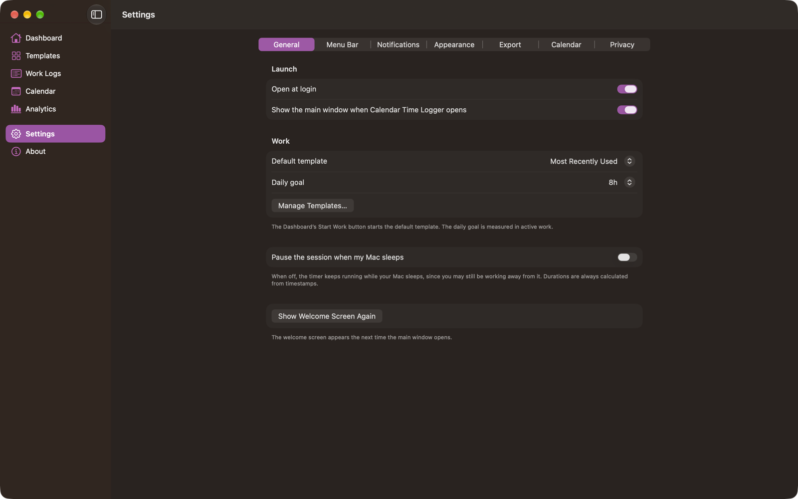

# Settings

Settings are in seven panes, reachable two ways:

- **Settings** in the sidebar of the main window, with the panes across the top.
- The **Settings** window (<kbd>⌘</kbd><kbd>,</kbd>, or the menu bar popover), which adds an **About** tab.

Both edit the same preferences.

## General

| Setting | Default | Effect |
| --- | --- | --- |
| **Open at login** | — | Registers Calendar Time Logger as a macOS login item. The switch reflects what macOS currently has registered, not a stored preference. If macOS needs approval, a link to Login Items appears. |
| **Show the main window when Calendar Time Logger opens** | On | Off starts the app with only its CTL menu bar item. |
| **Default template** | Most Recently Used | Which template the Dashboard's **Start Work** button starts. |
| **Daily goal** | 8h | The active-work target shown on the Dashboard's Today's Progress. Off, or 1 to 10 hours. |
| **Pause the session when my Mac sleeps** | Off | On pauses a running session when the Mac sleeps. Off keeps it running, because you may still be working away from your Mac. Durations are always calculated from timestamps either way. |
| **Manage Templates…** | — | Switches to the Templates section. |
| **Show Welcome Screen Again** | — | The welcome screen appears the next time the main window opens. |

## Menu Bar

| Setting | Default | Effect |
| --- | --- | --- |
| **Show CTL in the menu bar** | On | Off removes the item entirely. Use the main window or the Session menu instead. |
| **When not working, show** | CTL Mark | CTL Mark, CTL Outline, CTL Text, or Clock Symbol. Previewed on a light and a dark strip. |
| **Show seconds in the duration** | On | `02:04:10` versus `02:04`. |
| **Display for new templates** | Icon + Name + Duration | The display mode a newly created template starts with. |

Everything else about the menu bar item during a session — display mode, colors, background pill, separator — belongs to the individual template. See [Templates](Templates.md#menu-bar-preview-and-settings) and [Menu Bar](Menu%20Bar.md).

## Notifications

| Setting | Default | Effect |
| --- | --- | --- |
| **System permission** | — | Shows Not Requested, Allowed, or Off, with a button to request it or open macOS notification settings. |
| **Enable notifications** | On | The master switch for the whole app. |
| **Session starts** | On | Allows start notifications. Each template still decides for itself. |
| **Session ends** | On | Allows completion notifications. |
| **Include today's total when a session ends** | On | Adds today's total to the completion notification. |
| **Long session reminders** | On | Allows reminders. Each template sets its own interval. |
| **Calendar sync problems** | On | Notifies when a finished session could not be added to Calendar. |

See [Notifications](Notifications.md).

## Appearance

| Setting | Default | Choices |
| --- | --- | --- |
| **Appearance** | System | System, Light, Dark |
| **Accent color** | System | System, Blue, Purple, Pink, Red, Orange, Yellow, Green, Graphite |
| **Layout density** | Comfortable | Comfortable, Compact |

Template colors are their own and are not affected by the accent color.

## Export

| Setting | Default | Effect |
| --- | --- | --- |
| **Format** | — | Excel Workbook (.xlsx). Not configurable. |
| **Default scope** | All Work Logs | Which scope a new export starts with. |
| **Include a Summary sheet** | On | Adds totals by template, category, task priority, day, and week. |
| **Columns** | 16 of 17 | How many export columns are selected. **Reset** restores the default set and order; choose the columns themselves in the export sheet. |
| **Show the exported file in Finder** | On | Reveals the file after a successful export. |
| **Export Work Logs…** | — | Opens the export sheet. |

See [Exporting Data](Exporting%20Data.md).

## Calendar

The same controls as the Calendar section, minus the per-template list and sync issues:

| Setting | Default | Effect |
| --- | --- | --- |
| **Access** | — | The current permission, with a button to connect or to open Privacy & Security settings. |
| **Add finished sessions to Calendar** | On | Off means no events are created. Sessions are still recorded. |
| **Default calendar** | System Default | Where events go when neither the session nor its template names one. |
| **Include session notes in events** | On | Adds your notes to the event. |
| **Include tags in events** | On | Adds the session's tags to the event. |
| **Calendar event boundaries** | Keep exact times | **Keep exact times** writes each session's exact start and finish. **Round to the nearest minute** rounds only the Calendar event, so back-to-back sessions stack cleanly; work logs keep exact times. See [Calendar](Calendar.md#sessions-that-end-and-start-at-the-same-time). |
| **Update Existing Events…** | — | Applies the choice above to events Calendar Time Logger already created, after confirmation. Only its own existing events whose times differ are changed. Needs Calendar sync on and full access. |
| **Event color** | — | Read-only: set by each event's calendar. |

See [Calendar](Calendar.md).

## Privacy

A plain statement of what is stored and where, rather than settings to change:

- **Stored on This Mac** — templates, sessions, notes, tags, and settings are local. No iCloud sync, and the app makes no network requests of its own.
- **Sent to Apple Calendar** — the template name, start and finish times, a summary with active and paused time, and optionally tags and notes. Calendar may then sync that event to accounts you have set up.
- **Exports** — written only where you choose in the Save panel.
- **Permissions** — the current Calendar and Notifications status, with a button to open Privacy & Security settings.

The full statement is in [PRIVACY.md](../Product/PRIVACY.md).

## About

The app icon, the name, the version and build number, the author (**Developed by Abir Barman**, with a link to [abirbarman.com](https://abirbarman.com) that opens in your browser), the copyright, and three statements about how the app behaves. In the main window's **About** section these are listed in full:

- Live work is the source of truth. A Calendar event is created only when you finish a session, using its real start and finish times.
- Your data stays on this Mac. There is no account, sync service, or tracking.
- Icons are SF Symbols.

## Where settings are stored

Preferences live in Calendar Time Logger's own sandbox container, not in your calendars or in any file you export. To reset everything, quit the app and remove `~/Library/Containers/abirbarman.calender-time-logger`. That also deletes your templates and work logs.

---

[Back to User Guide](README.md) · [Previous: Exporting Data](Exporting%20Data.md) · [Next: Troubleshooting](Troubleshooting.md)
