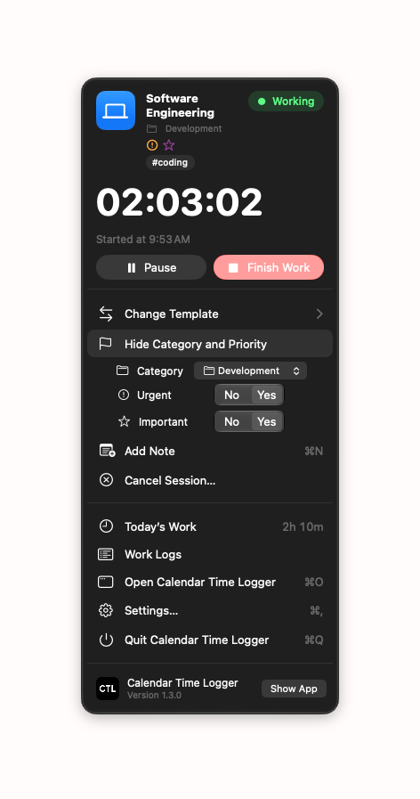

# Task Priority

Every session Calendar Time Logger records carries two values:

| Value | Question it answers |
| --- | --- |
| **Urgent** | Does this need attention now? |
| **Important** | Does this matter for what I am trying to achieve? |

Each is **Yes** or **No**. Both always have a value — there is no blank, unknown, or "not set" state, and nothing in the app is blocked waiting for you to choose one.

Together they describe four kinds of work:

| Combination | Typical work |
| --- | --- |
| **Urgent + Important** | A production break, a deadline today |
| **Urgent + Not Important** | An interruption that still has to be handled |
| **Not Urgent + Important** | The work that moves things forward |
| **Not Urgent + Not Important** | Everything else you still spent time on |

The app stores the two answers, not the combination, so it can tell you both "how much urgent work did I do" and "how much was urgent *and* important".

## Where the values come from

**A template sets the defaults.** Every template has a **Task Priority** section in its editor (Templates › select a template), directly under **Basic Information**. Templates created before this feature — and every new template — start at **Urgent: No, Important: No**.

Each value is a **No / Yes** control. A value set to **Yes** also shows a filled, colored symbol and bold label beside the control, and the section header (and the editor's title) shows an **Urgent** or **Important** badge, so the state is clear without reading the control. Colors are never the only signal: the symbols differ in shape, the badges are worded, and VoiceOver reads "Urgent, Yes".

**A session keeps its own values.** When a session starts, the template's values are copied onto it. From that moment the session owns them:

- Changing the template later **never** changes work you have already recorded.
- Changing a session's priority never changes its template.

## Choosing the priority when you start

**Start Work** shows the values before the timer starts, so you can change them for this session only.

| How you start | What happens |
| --- | --- |
| **Start Work** on the Dashboard, the toolbar's **New Session**, or **Session › Start Work…** (<kbd>⌥</kbd><kbd>⌘</kbd><kbd>S</kbd>) | The Start Work sheet opens. Review or change the priority, then **Start Session**. |
| A template in the Start Work menu, a **Recent Templates** tile, **Session › Start Template**, <kbd>⌃</kbd><kbd>⌘</kbd><kbd>1</kbd>–<kbd>9</kbd>, a template row in the menu bar, or the Shortcuts action | Starts immediately with that template's own values. |
| **Start with Category and Priority…** in a menu bar template row | Shows the category menu and the two controls in the popover first. |

The sheet's **Session Priority** section tells you which it is: *"These are Research's defaults"*, or *"Changed for this session only"* with a **Use Template Defaults** button that puts the template's values back. Changing the values here never changes the template.

## Quick New Task

**Quick New Task** (<kbd>⌥</kbd><kbd>⌘</kbd><kbd>N</kbd>) starts work that does not belong to a template — a one-off interruption, an errand, a fix. You give it a name, a [category](Categories.md) (General unless you choose another), and the two priority values, and it starts.

- Available from the Dashboard (**Quick Actions**, and beside **Start Work**), **Session › Quick New Task…**, and the menu bar popover (<kbd>⌘</kbd><kbd>T</kbd>).
- **More Options** adds tags, notes, and a calendar for this session.
- **No template is created.** The session is recorded under the name you typed and appears in Work Logs, analytics, Calendar, and exports like any other session.
- **Start Work** stays disabled until the task has a name. Priority never blocks it, because it always has a value.

## Changing the priority while you work

Work often turns out to be more urgent than it looked. The priority of the open session can be changed at any time:

- Dashboard: the **Task Priority** button on the session card, its **⋯** menu, or **Quick Actions**.
- Menu bar popover: **Change Category and Priority**, which shows the category menu and the two controls inline.
- **Session › Change Category and Priority…**.

The same places change the session's [category](Categories.md).

**The Work Log records the values the session ends with.** Intermediate values are not kept.

## Where priority appears afterwards

| Screen | What it shows |
| --- | --- |
| **Work Completed** | The chips, and a **Task Priority** row naming the combination |
| **Menu bar** popover | **Urgent** and **Important** badges under the running session's name and category (symbols alone if the popover is too narrow) |
| **Work Logs** list | **Urgent** and **Important** chips on each row. When the list is narrow, each row switches to two lines with the symbols beside the name |
| **Work Logs** detail | A **Task Priority** section with Yes / No for each value and the combination in words |
| **Work Logs** filter | **Task Priority**: All, Urgent, Important, Urgent + Important, Neither |
| **Analytics** | A **Task Priority** section for the selected date range — see [Analytics](Analytics.md) |
| **Calendar event** | A line in the event notes: `Urgent: Yes · Important: No`. The event title stays the template name. |
| **Excel export** | Independent **Urgent** and **Important** columns, and an optional **Task Priority** column — see [Exporting Data](Exporting%20Data.md) |

## Correcting a finished session

Open the session in **Work Logs**, choose **Edit**, and change **Urgent** or **Important** in the **Task Priority** section. Saving updates the work log and, if the session has one, its Calendar event.

## Work recorded before this feature

Every session recorded by an earlier version reads as **Urgent: No, Important: No**. Nothing was rewritten, and no template lost any of its other settings. Correct any of them individually with **Edit** if you want to.

---

[Back to User Guide](README.md) · [Previous: Sessions](Sessions.md) · [Next: Categories](Categories.md)
