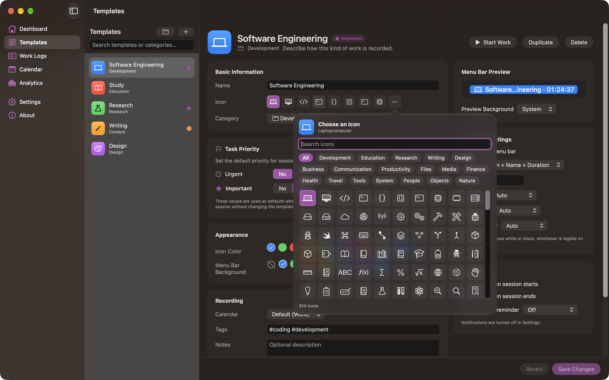

# Templates

A template describes **how** a kind of work is recorded — its name, icon, category, color, calendar, tags, menu bar appearance, and notifications. It does not describe **when** the work happens and it has no duration.

> **A template never determines how long a Calendar event is.** The event covers the real start and finish times of the session you ran. See [Calendar](Calendar.md).

## The Templates section

The list on the left holds every template. The editor on the right applies to the selected one.

The editor's sections, top to bottom, are **Basic Information**, **Task Priority**, **Appearance**, **Recording**, and **Calendar Event Appearance**, with **Menu Bar Preview**, **Menu Bar Settings**, and **Notifications** beside them when the window is wide enough and below them when it isn't. The sections scroll; **Cancel** and **Create Template** (or **Revert** and **Save Changes**) stay in a footer at the bottom that is always visible, however small the window. When the editor is narrow, **Start Work**, **Duplicate**, and **Delete** move under the template's name, and the icon and color rows wrap.

| Task | How |
| --- | --- |
| Create | The **+** button, or <kbd>⌘</kbd><kbd>N</kbd>. Opens the editor as a sheet. |
| Search | The search field matches template names, categories, and tags. |
| Manage categories | The folder button beside **+** opens **Categories**, where you add, rename, and delete categories and move templates between them. See [Categories](Categories.md). |
| Reorder | Drag a row. Ordering sets the <kbd>⌃</kbd><kbd>⌘</kbd><kbd>1</kbd>–<kbd>9</kbd> shortcuts and the order in the menu bar popover. Dragging is disabled while a search filter is active. |
| Duplicate | Right-click a row, or **Duplicate** in the editor. The copy is named "*Name* Copy" and is placed after the original. |
| Start | Right-click a row and choose **Start Work**, or use the editor's **Start Work** button. |
| Edit | Select a row, or right-click it and choose **Edit Template**. |
| Delete | **Delete** in the editor, right-click a row and choose **Delete…**, or **Edit › Delete** with a row selected; then confirm. **Cancel** or <kbd>Esc</kbd> deletes nothing. |

Each row shows the template's category under its name. A row with a green record symbol is the template of the session running right now.

**Deleting a template keeps your work.** Past sessions recorded under it stay in Work Logs and analytics with the name, icon, and color they had at the time. If the template is the one you are working on right now, the confirmation says so: the session keeps running and is saved as usual when you finish it.

### Saving

The editor works on a draft. **Save Changes** (<kbd>⌘</kbd><kbd>S</kbd>) applies it; **Revert** discards it. Both are disabled until something changes. **Start Work** and **Duplicate** are disabled while there are unsaved changes.

If the name is empty, longer than 60 characters, or already used by another template, or the category is empty or longer than 40 characters, the footer explains the problem and nothing is saved.

## Basic Information

**Name** is what appears in the menu bar, in Work Logs, in analytics, and as the **title of every Calendar event** the template produces. Up to 60 characters, and unique regardless of capitalization.

**Icon** is an SF Symbol. The row offers the current symbol plus seven others from the same icon group; the **⋯** button opens the full picker.

**Category** is mandatory and groups this template's work in Work Logs, Analytics, and exports. Pick one from the menu, or choose **New Category…** to type a new name; it is added to the category list straight away. If the category you picked is renamed or deleted while the editor is open, the menu follows the change. Sessions started from the template begin in this category; changing it later never changes work already recorded. See [Categories](Categories.md).

## Icons are SF Symbols

Calendar Time Logger uses Apple's SF Symbols for template icons. There is no emoji anywhere in the interface.

The picker offers **314 symbols** in 18 categories:

Development, Education, Research, Writing, Design, Business, Communication, Productivity, Files, Media, Finance, Health, Travel, Tools, System, People, Objects, Nature.

- **Search** matches the words of a symbol's name, Apple's own keywords for it, and category titles. Searching `code` finds `chevron.left.forwardslash.chevron.right`; searching `laptop` finds `laptopcomputer`.
- **Category chips** narrow the grid; **All** shows everything. The chips wrap onto more lines, so every category is visible without scrolling sideways.
- The picker opens scrolled to the current icon, which is highlighted in the accent color.
- Clicking an icon chooses it and closes the picker. <kbd>Return</kbd> in the search field chooses the first match; <kbd>Esc</kbd> closes the picker without changing the icon.
- The header names the selected symbol in readable form, so you always know which one you picked.

Every name in the picker is checked against the SF Symbols installed with macOS when the catalog is built, so a template can never be given an icon that will not draw.

The default icon for a new template is `briefcase`. Symbols used by the five default templates are `laptopcomputer`, `book`, `flask`, `pencil`, and `paintpalette`.

### Upgrading from 1.0

Calendar Time Logger 1.0 stored an emoji as the template icon. The first launch of 1.1.0 converts those to matching symbols — once, for templates and for past work logs alike. An emoji with no sensible match becomes a generic symbol you can change. Only the icon value changes; nothing else about your data is touched.

## Task Priority

**Urgent** and **Important** are the values sessions started from this template begin with. Both are always Yes or No; a new template, and every template created before this feature, starts at **No / No**.

These are defaults, not rules: the priority can be changed for a single session when it starts or while it runs, and changing the template afterwards never alters work already recorded. See [Task Priority](Task%20Priority.md).

The section sits directly under **Basic Information**, so it is visible without scrolling. A value set to **Yes** shows a filled, colored symbol and a bold label; the section header and the editor title show worded **Urgent** and **Important** badges (**Neither** when both are No). The template list shows a small filled symbol for each value a template sets.

## Appearance

| Setting | Effect |
| --- | --- |
| **Icon Color** | The tint of the template's icon everywhere in the app. Pick a palette swatch, or any color with the system color picker. |
| **Menu Bar Background** | An optional colored pill behind the menu bar item. **None** (the slashed circle) draws no pill. |

## Recording

| Setting | Effect |
| --- | --- |
| **Calendar** | Which calendar this template's events go to. **Default** follows **Settings › Calendar › Default calendar**, and that in turn follows your system default calendar. Only calendars you can write to are offered. |
| **Tags** | Space-separated, written as `#coding #development`. Every session started from the template begins with these tags, and they can appear in the Calendar event. |
| **Notes** | A description of the template, shown under its name in the editor. This is **not** copied into sessions or Calendar events. |

If Calendar access has not been granted, a line under the picker points you to the Calendar section.

## Calendar Event Appearance

This card shows the color the template's events will actually be, and explains why you cannot set it directly:

> Apple Calendar colors each event by the calendar it belongs to. EventKit has no per-event color, so a template can't give its events their own color.

To make a template's work stand out in Calendar, point it at a calendar that already has the color you want, under **Recording**. **Match Icon Color to Calendar** does the reverse for tidiness: it sets the template's *icon* color to the calendar's color. It never changes the calendar.

See [ADR-017](../Decisions/ADR-017-calendar-event-color-limitation.md) for the reasoning.

## Menu Bar Preview and Settings

The preview draws the menu bar item exactly as macOS will, using this template's settings and a sample duration. The **Preview Background** picker switches between a light, dark, and system menu bar so you can check both.

| Setting | Effect |
| --- | --- |
| **Show in menu bar** | Off hides this template's identity while it runs. The item then shows a generic timer symbol, so the menu bar still tells you a session is going. |
| **Display** | One of six modes: Icon Only, Name Only, Duration Only, Icon + Duration, Name + Duration, Icon + Name + Duration. |
| **Show icon with name** | Only for **Name Only** — adds the icon back. |
| **Separator** | The text between the name and the duration. Default is a middle dot with spaces. Shown only when the mode has both. |
| **Icon color**, **Name color**, **Duration color** | **Auto** or a specific color, each shown only when that mode uses that part. |

**Auto** means: with no background pill, the part matches the menu bar's own text color in light and dark appearance; on a pill, it becomes white or black, whichever stays legible. The card says which rule is in effect.

New templates start with the display mode from **Settings › Menu Bar › Display for new templates**.

See [Menu Bar](Menu%20Bar.md) for how these look in use.

## Notifications

| Setting | Effect |
| --- | --- |
| **Notify when session starts** | Off by default |
| **Notify when session ends** | On by default |
| **Long session reminder** | Off, or every 15, 30, 45, 60, 90, or 120 minutes of *active* work |

These are per template, and the global switches in **Settings › Notifications** can still turn each category off. If notifications are off globally, the card says so. See [Notifications](Notifications.md).

---

[Back to User Guide](README.md) · [Previous: Dashboard](Dashboard.md) · [Next: Menu Bar](Menu%20Bar.md)
