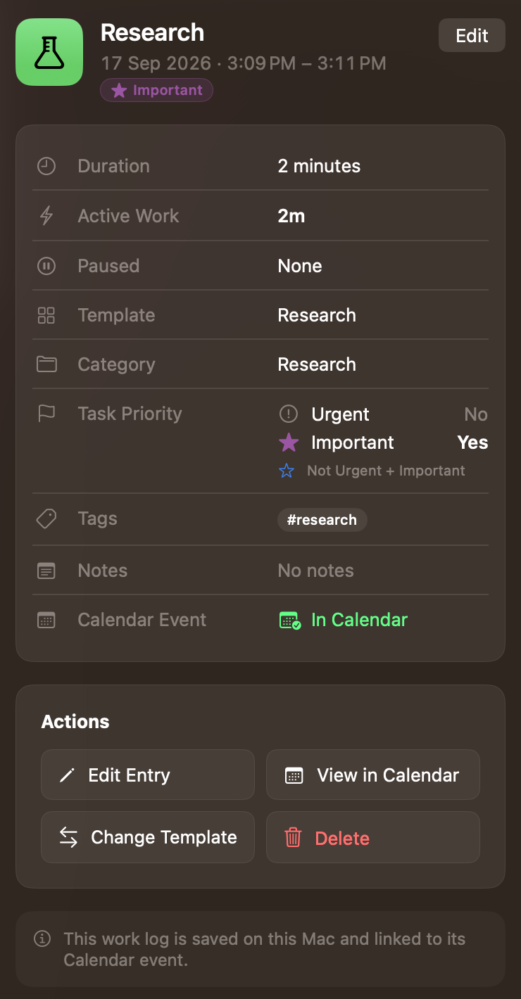
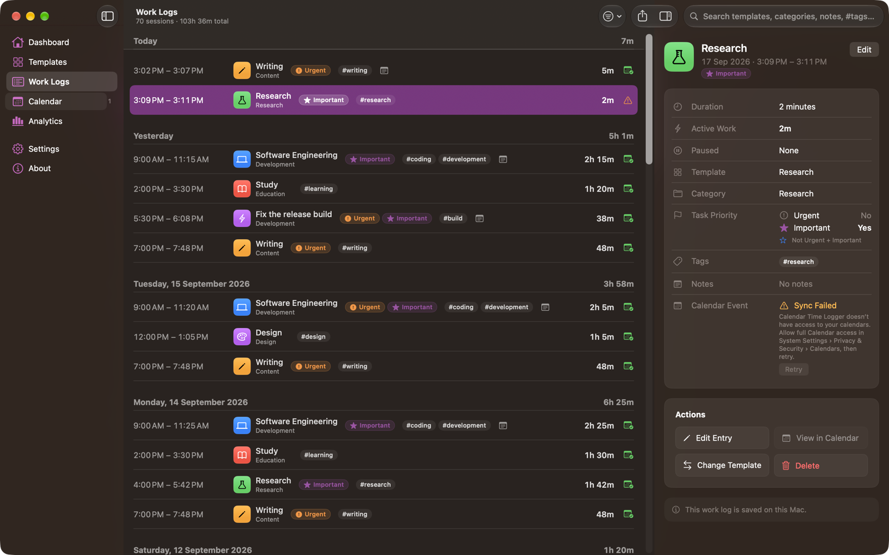

# Work Logs

Work Logs is the record of everything you have finished. Cancelled sessions and the session running right now are not listed here.

## The list

Sessions are grouped by the day they **started**, newest day first, oldest session first within a day. Each day header carries that day's total active work. Work that runs past midnight stays on the day it began and is not split.

Each row shows the time range, the template icon and name with the session's **category** in smaller text beneath it, the **Urgent** and **Important** chips, up to two tags, a note symbol if the session has notes, the active duration, and the Calendar status. Priority chips and tags give way to the template name as the window narrows: tags are dropped first, then the chips become symbols alone.

The window subtitle summarizes what you are looking at, for example "19 sessions · 27h 6m total", and says how many of the total are showing when a filter is active.

## Search and filters

**Search** (the toolbar field) matches template names, categories, note text, and tags. Typing `#research` or `research` both find the tag.

The **Filter** menu adds:

| Filter | Choices |
| --- | --- |
| **Date** | All Time, Today, This Week, This Month |
| **Template** | All Templates, or one template |
| **Category** | All Categories, or one category recorded in your work logs |
| **Tag** | All Tags, or one tag in use |
| **Task Priority** | All Priorities, Urgent, Important, Urgent + Important, Neither |
| **Calendar** | Any Status, Not in Calendar, In Calendar, Sync Failed, Event Missing |

The filter icon fills in when any of these is set. **Clear Filters** resets them; it does not clear the search field.

The current search and filters also drive the export scope **Current Filter**. See [Exporting Data](Exporting%20Data.md).

## The detail inspector

Select a row to see its details. The toolbar's **Show Details** / **Hide Details** button toggles the inspector.

| Field | Meaning |
| --- | --- |
| **Duration** | Wall clock, start to finish, in words |
| **Active Work** | Duration minus paused time |
| **Paused** | Total paused time and the number of pauses, or **None** |
| **Template** | The template name recorded with the session, or the quick task's name marked *(quick task)* |
| **Category** | The category recorded with the session. It does not change when a template's category changes later. |
| **Task Priority** | **Urgent** and **Important**, each Yes or No, with the combination named below them |
| **Tags** | The session's tags |
| **Notes** | The session's notes, selectable for copying |
| **Calendar Event** | The sync status, and where the event was created |

The footnote states plainly where the record lives: on this Mac, and linked to its Calendar event when it has one.

## Actions

| Action | What it does |
| --- | --- |
| **Edit Entry** (<kbd>⌘</kbd><kbd>E</kbd>) | Opens the edit sheet |
| **View in Calendar** | Opens the Apple Calendar app. Enabled only for sessions that are in Calendar. |
| **Change Template** | Moves the session to another template and updates its Calendar event |
| **Delete** | Removes the session, after a confirmation |

The same actions are on each row's shortcut menu (right-click): **Show Details**, **Edit Entry…**, **View in Calendar**, and **Delete…**. They act on the row you clicked, even when another row is selected. Pressing <kbd>Delete</kbd> (or **Edit › Delete**) with a row selected asks to delete that work log.

### Editing a session

The edit sheet changes **Started**, **Finished**, **Category**, **Urgent**, **Important**, **Tags**, **Notes**, and the **Calendar** the event belongs to. Changing the category here corrects this work log only; no template is changed.

- The finish time must be after the start time, and cannot be in the future.
- Times are chosen to the minute. A time you change is stored as that whole minute (11:00 means 11:00:00); a time you don't touch keeps its recorded seconds.
- If the new times overlap another work log, the sheet names it under **Time**. You can still save. A work log that ends at 11:00 and one that starts at 11:00 don't overlap.
- **Task Priority** here changes this recorded session only; the template's defaults aren't changed.
- Pauses that fall outside the new range are trimmed, and the sheet warns you before you save. Individual pauses cannot be edited.
- Saving updates the Calendar event Calendar Time Logger created for the session.

If Calendar sync is turned off when you save, the existing event is not updated.

### Changing the template of a completed session

**Change Template** is for work recorded under the wrong template. Timing and notes stay exactly as they are. The session takes the new template's name, icon, and color; its tags become the new template's tags plus any you had added yourself. Its category follows the new template if the session still had the old template's category; a category you chose for the session yourself is kept. Task priority never changes. If the session already has a Calendar event, that event is updated in place rather than duplicated. A session that was never in Calendar stays out of it.

### Deleting a session

Deleting is permanent. When the session has a Calendar event, you are asked which you want:

- **Delete and Remove Calendar Event** — both go.
- **Delete, Keep Calendar Event** — the work log goes, the event stays.

Only the event Calendar Time Logger created can be removed. If removing the event fails, nothing is deleted, so you are never left with a missing record and a stale event.

**Cancel** in the confirmation, or <kbd>Esc</kbd>, deletes nothing. Once a work log is deleted, the details pane shows **No Selection**.

## Calendar status

| Status | Meaning |
| --- | --- |
| **In Calendar** | An event exists and matches the session |
| **Not in Calendar** | No event, and none was attempted — usually because sync is off |
| **Sync Failed** | The last attempt failed. Your work log is safe. |
| **Event Missing** | The event was deleted in Calendar outside this app |

When a session is not in Calendar, the inspector offers **Add to Calendar** or **Retry**, with the reason it failed and what to do about it. The **Calendar** section has a **Retry All** for fixing them in one go. See [Calendar](Calendar.md).

## Exporting

The toolbar's **Export** button (also <kbd>⇧</kbd><kbd>⌘</kbd><kbd>E</kbd>) saves completed sessions as an Excel workbook. Starting the export from Work Logs preselects **Current Filter** when a filter is active. See [Exporting Data](Exporting%20Data.md).

---

[Back to User Guide](README.md) · [Previous: Menu Bar](Menu%20Bar.md) · [Next: Calendar](Calendar.md)
