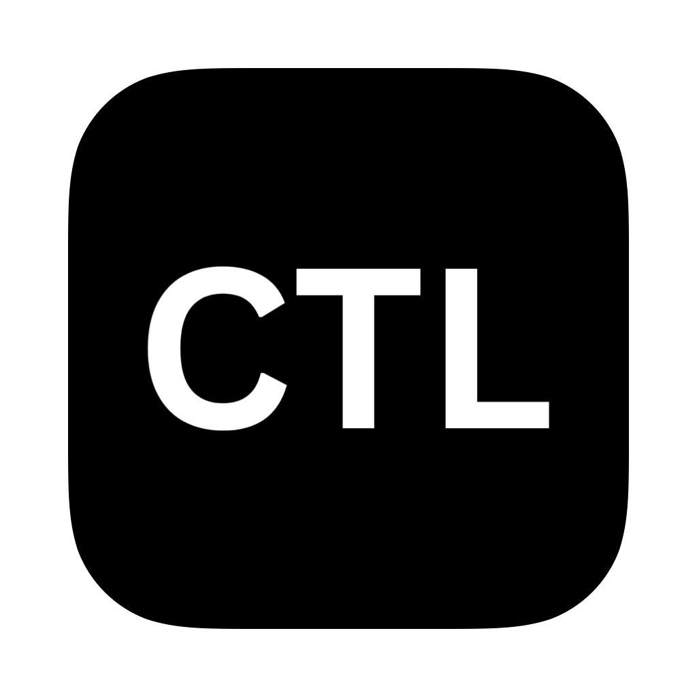
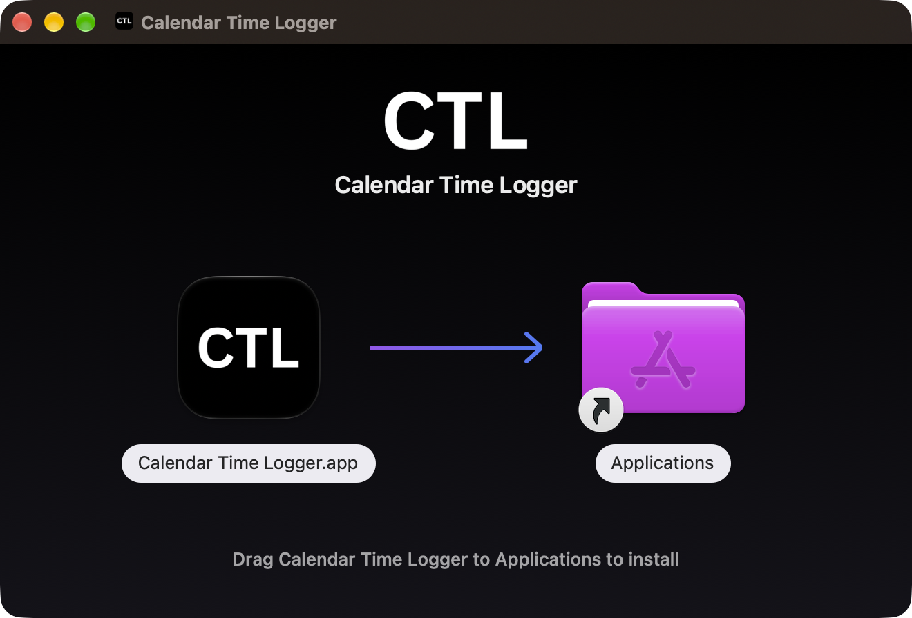
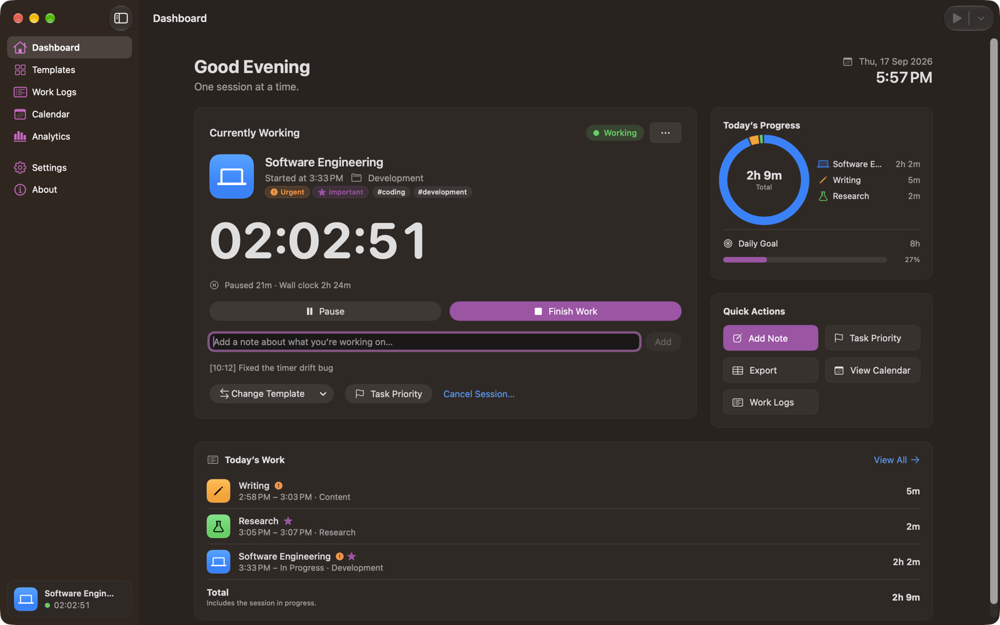
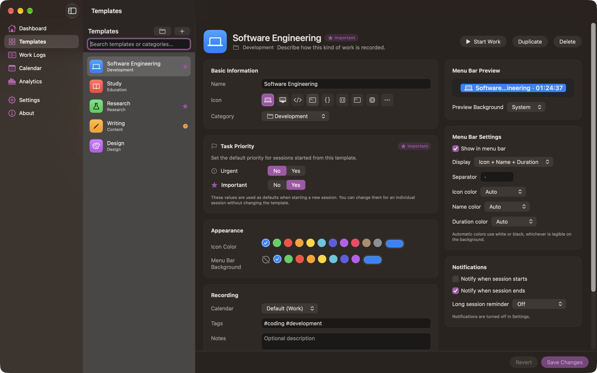
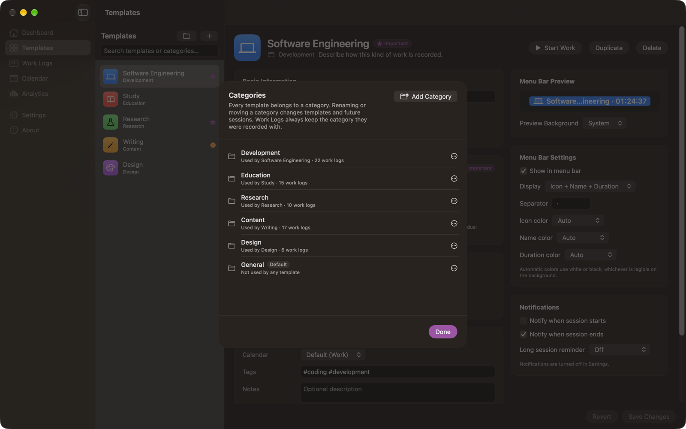
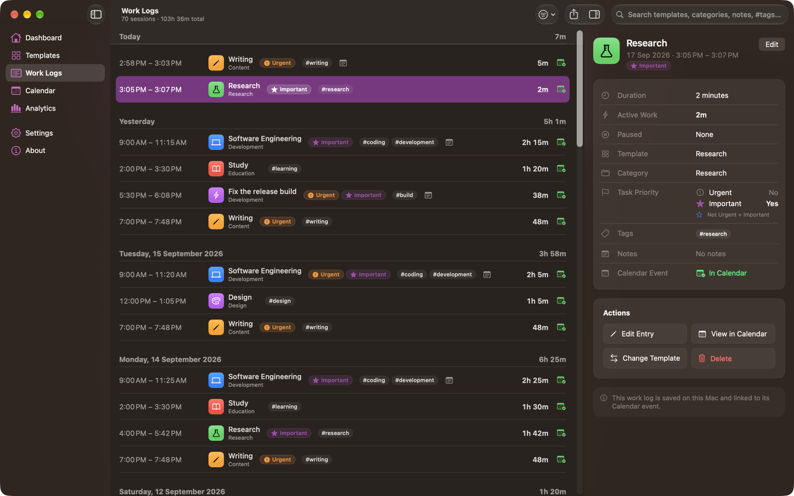
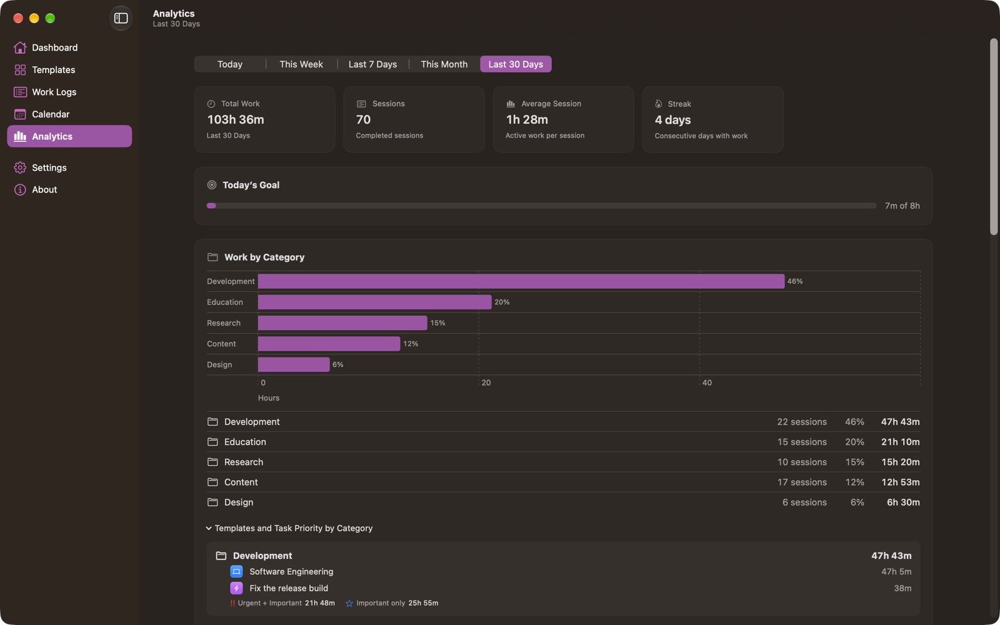
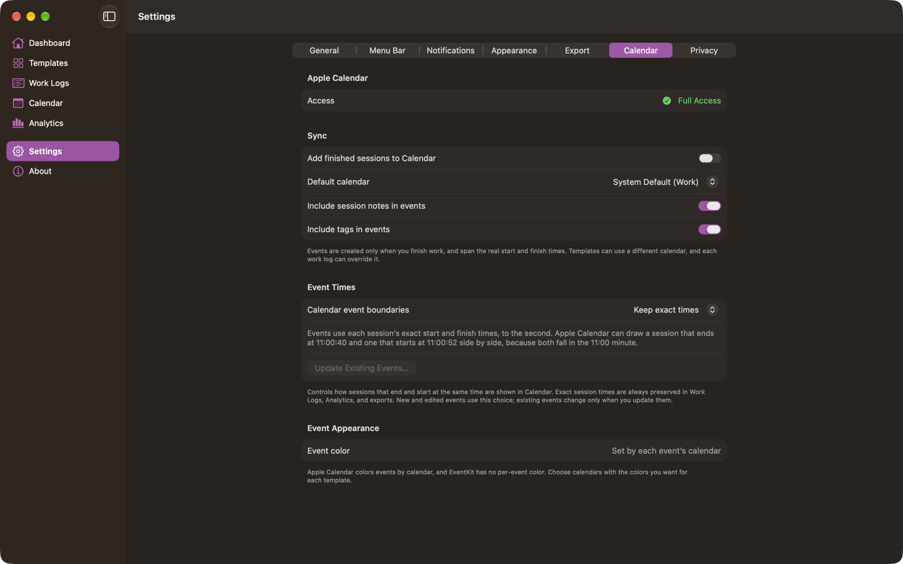
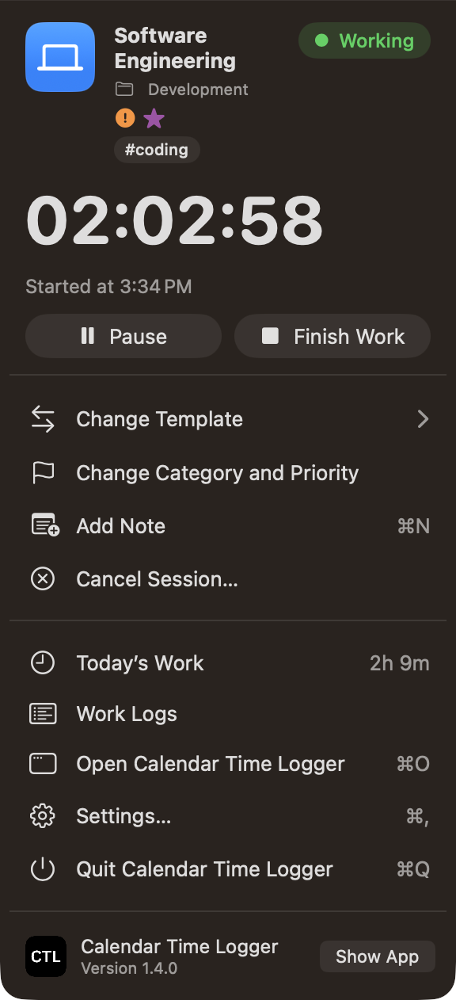

<div align="center">



# Calendar Time Logger

**Live work tracking for macOS. Record work as it happens; each finished session becomes an accurate Apple Calendar event.**

[](https://github.com/abarman152/calendar-time-logger/releases/latest)


[](LICENSE)

**[Download for macOS](https://github.com/abarman152/calendar-time-logger/releases/latest)** · [Installation](#installation) · [User Guide](Documentation/User%20Guide/README.md)

</div>

**Contents:** [Installation](#installation) · [About](#about) · [Features](#features) · [Screenshots](#screenshots) · [Getting Started](#getting-started) · [Templates](#templates) · [Categories](#categories) · [Task Priority](#task-priority) · [Menu Bar](#menu-bar) · [Calendar](#calendar) · [Work Logs](#work-logs) · [Analytics](#analytics) · [Excel Export](#excel-export) · [Settings](#settings) · [Development](#development) · [Testing](#testing) · [Release](#release) · [Documentation](#documentation) · [Contributing](#contributing) · [License](#license) · [Author](#author)

## Installation

**[Download Calendar Time Logger 1.4.0 (DMG)](https://github.com/abarman152/calendar-time-logger/releases/download/v1.4.0/Calendar-Time-Logger-v1.4.0.dmg)** · [All releases](https://github.com/abarman152/calendar-time-logger/releases)

### Requirements

| | |
| --- | --- |
| macOS | 27.0 or later |
| Calendar access | Full access, only if you want sessions added to Apple Calendar |
| Notifications | Optional |
| Network | None. The app is sandboxed without the network entitlement. |

### Option 1: Install from the disk image



1. Download `Calendar-Time-Logger-v1.4.0.dmg` from the [latest release](https://github.com/abarman152/calendar-time-logger/releases/latest).
2. Open the downloaded disk image. A window shows **Calendar Time Logger** and an **Applications** folder.
3. Drag **Calendar Time Logger** onto **Applications**.
4. Eject the disk image and open **Calendar Time Logger** from Applications.
5. On first launch, allow Calendar access if you want sessions added to Apple Calendar, and notifications if you want them. Both can be changed later in **System Settings › Privacy & Security**.

**First-launch security check.** The app is signed with a personal Apple Development certificate and is **not notarized**, so macOS blocks the first launch of a downloaded copy because it can't verify the developer. Dismiss the warning, open **System Settings › Privacy & Security**, and click **Open Anyway** next to the message about Calendar Time Logger. You only need to do this once.

**Verify the download (optional).** Each release lists the disk image's SHA-256 checksum. Compare it with:

```bash
shasum -a 256 ~/Downloads/Calendar-Time-Logger-v1.4.0.dmg
```

**Upgrading.** Quit the running copy, then drag the new version onto Applications and replace the old one. Installing 1.4.0 over 1.3 migrates your data in place and builds a stored category list from your templates; no template or work log is rewritten. Earlier versions can't open the data afterwards. Only one copy of the app runs at a time.

### Option 2: Build from source

Requires Xcode 27 (built with Xcode 27.0 beta).

```bash
git clone https://github.com/abarman152/calendar-time-logger.git
cd calendar-time-logger

# Use Xcode 27 if xcode-select points at the Command Line Tools
export DEVELOPER_DIR=/Applications/Xcode-beta.app/Contents/Developer

xcodebuild -project calender_time_logger/calender_time_logger.xcodeproj \
  -scheme calender_time_logger -configuration Release \
  -destination 'platform=macOS' -derivedDataPath .build/DerivedData build

open ".build/DerivedData/Build/Products/Release/Calendar Time Logger.app"
```

Or open `calender_time_logger/calender_time_logger.xcodeproj` in Xcode, select the **calender_time_logger** scheme and **My Mac**, set your own team under **Signing & Capabilities**, and choose **Product › Run**. To build the disk image yourself, run `scripts/package-dmg.sh` (see [Release](#release)).

## About



Calendar Time Logger records the work you actually do, while you do it. Starting a template adds nothing to your calendar. When you choose **Finish Work**, the session is saved to Work Logs first and only then written to Apple Calendar with its real start and finish times, so a Calendar problem never costs you the record of your work.

> **Your actual work is the source of truth. Apple Calendar is the output.**

## Features

| Area | What you get |
| --- | --- |
| Time tracking | Start, Pause, Resume, Finish Work, and Cancel Session. Durations come from timestamps: wall clock and active time (pauses excluded). |
| Templates | Reusable kinds of work with an SF Symbol icon, color, category, calendar, tags, notes, priority defaults, menu bar style, and notifications |
| Quick New Task | Named, categorized work without creating a template |
| Categories | One category per template and per session; add, rename, move templates, and delete with a safe migration |
| Task priority | **Urgent** and **Important** (Yes/No) on every session, with template defaults |
| Menu bar | A **CTL** item with a popover for the whole session lifecycle |
| Work Logs | Day-grouped history with search, filters, an inspector, editing, and deletion |
| Calendar | Events only for finished sessions, with exact times and a Calendar event boundaries setting |
| Analytics | Totals, streak, daily goal, work by category, task priority, template, and day |
| Excel export | `.xlsx` workbooks with the columns you choose, in your order, plus an optional Summary sheet |
| Native macOS | SwiftUI, SF Symbols, keyboard shortcuts, Shortcuts actions, light and dark appearance |

## Screenshots

| Template editor | Categories |
| --- | --- |
|  |  |

| Work Logs | Analytics |
| --- | --- |
|  |  |

| Calendar settings | Menu bar during a session |
| --- | --- |
|  |  |

The complete, screen-by-screen walkthrough is in the [User Guide](Documentation/User%20Guide/README.md).

## Getting Started

1. **Choose a category.** Six are built in (Development, Education, Research, Content, Design, General). Add your own in **Templates › Categories** (the folder button).
2. **Create a template.** In **Templates**, click **+**, then set a name, icon, and category.
3. **Configure it.** Pick the calendar, set **Urgent** and **Important** defaults, and choose how it looks in the menu bar.
4. **Start Work.** From the CTL menu bar item, the Dashboard, or **Session › Start Work**. Nothing is added to Calendar yet.
5. **Finish Work.** The session is saved to Work Logs, then written to Calendar from its real start to its real finish.
6. **Review.** Work Logs, Calendar, and Analytics show what you did; export to Excel when you need a report.

A session that runs from 9:00 to 11:15 with a 25-minute pause becomes a 9:00–11:15 Calendar event whose notes record 1h 50m of active work. **A template never decides how long an event is.**

## Templates

A template describes how a kind of work is recorded, not how long it lasts:

- **Basic Information:** name, SF Symbol icon (searchable picker), and category.
- **Task Priority:** the Urgent and Important defaults for new sessions.
- **Appearance:** icon color and menu bar background.
- **Recording:** the calendar, tags, and notes.
- **Menu Bar:** whether the template shows in the menu bar, its display mode, separator, and text colors, with a live preview.
- **Notifications:** start and finish notifications and a long-session reminder.

Five templates are created on first launch (Software Engineering, Study, Research, Writing, Design). **Duplicate** and **Delete** are in the editor and each row's shortcut menu; deleting a template keeps every session recorded under it. See [Templates](Documentation/User%20Guide/Templates.md).

## Categories

Every template and every session has exactly one category.

| Action | What happens |
| --- | --- |
| **Add Category** | Saved immediately, even before a template uses it. Names are up to 40 characters; a name that matches an existing one (ignoring case) is refused. |
| **Rename…** | Renames the category on every template that uses it. Renaming onto an existing name merges the two. |
| **Move Templates…** | Moves every template in the category to another one; the category stays. |
| **Delete…** | Unused: confirm and delete. Used by templates: choose where to move them, then **Move and Delete**. The move and the delete happen together, and if anything fails nothing changes. |

For example, to retire **Work**, choose **Delete…**, move its templates to **General**, then confirm. **General** is the default category and can't be renamed or deleted.

**History is never rewritten.** Renaming, moving, or deleting a category changes templates and future sessions only. Work logs already recorded, and the session in progress, keep the category they had. A deleted category still appears on its old work logs, shown as "*Work* (deleted)" in Edit Entry. See [Categories](Documentation/User%20Guide/Categories.md).

## Task Priority

Every session records **Urgent** (Yes/No) and **Important** (Yes/No).

- **Template values are defaults.** A template with *Urgent: No, Important: Yes* starts sessions that way.
- **A session can override them** in the Start Work sheet, the menu bar's **Start with Category and Priority…**, or **Change Category and Priority** while it runs. Setting *Urgent: Yes, Important: No* for one session leaves the template unchanged.
- **Values are kept with the session.** Editing a template later never changes recorded work; **Edit Entry** corrects one work log.

Priority appears in the template editor, the Start Work and Quick New Task sheets, the Dashboard, the menu bar popover (worded chips when there is room, symbols otherwise), Work Completed, Work Logs rows, the inspector and filters, Analytics (the four Urgent/Important combinations), and Excel export (**Urgent**, **Important**, and **Task Priority** columns). See [Task Priority](Documentation/User%20Guide/Task%20Priority.md).

## Menu Bar

- **Idle:** the CTL item shows the CTL mark (or your choice in **Settings › Menu Bar › When not working, show**). Its popover offers Quick New Task and your templates.
- **During a session:** the item shows the template's icon, name, and duration in one of six display modes (Icon Only, Name Only, Duration Only, Icon + Duration, Name + Duration, Icon + Name + Duration), with the template's colors and background.
- **Popover:** pause, resume, finish, change template, category, and priority, add notes, cancel the session, and open Work Logs or Settings.
- **Settings › Menu Bar:** show or hide the CTL item, the idle presentation, seconds in the duration, and the default display for new templates.

See [Menu Bar](Documentation/User%20Guide/Menu%20Bar.md).

## Calendar

- **Permission.** Calendar Time Logger needs **Full Access** (Add Events Only can't list calendars or update events). **Connect Apple Calendar** shows the system prompt. Without access, sessions are still saved to Work Logs and marked **Sync Failed** with a retry path.
- **Which calendar.** A work log's calendar, otherwise the template's, otherwise the default calendar in **Settings › Calendar**.
- **Event creation.** Only when a session finishes, from its real start to its real finish. Event notes record active and paused time, the category, the priority, and optionally tags and notes.
- **Updates.** Editing a work log updates its event. Every event carries a `calendartimelogger://session/<id>` link, and only events with that link are ever updated or removed.

### Calendar event boundaries

Recorded times are half-open intervals, so sessions that meet are **adjacent, not overlapping**:

```
Session 1   10:00 AM → 11:00 AM
Session 2   11:00 AM → 12:00 PM   adjacent: the end of one is the start of the next
```

Calendar Time Logger never adds or removes a minute to separate them. Because recorded times include seconds, a session that ends at 11:00:40 and one that starts at 11:00:52 both fall inside the 11:00 minute, and Apple Calendar may draw them side by side. **Settings › Calendar › Event Times › Calendar event boundaries** controls how events are written:

| Choice | Calendar events use |
| --- | --- |
| **Keep exact times** (default) | Each session's exact start and finish, to the second |
| **Round to the nearest minute** | Start and finish rounded to whole minutes, so back-to-back sessions stack cleanly |

Only the Calendar event is affected. Work Logs, Analytics, and exports always keep the exact recorded times. **Update Existing Events…** applies the choice to events the app already created, changing only those whose times differ. See [Calendar](Documentation/User%20Guide/Calendar.md).

## Work Logs

Finished sessions grouped by day, each with its time range, duration, template, category, Urgent and Important chips, tags, a notes marker, and Calendar status. Search matches templates, categories, notes, and tags; filters cover date, template, category, tag, task priority, and Calendar status. The inspector shows wall-clock, active, and paused time and the Calendar event. You can edit times, category, priority, tags, notes, and calendar; change the template; retry a failed sync; and delete a work log with or without its Calendar event. See [Work Logs](Documentation/User%20Guide/Work%20Logs.md).

## Analytics

One range picker (Today, This Week, Last 7 Days, This Month, Last 30 Days) drives every figure: total work, sessions, average session, streak, today's goal, **Work by Category** (with the templates and priority combinations inside each category), **Task Priority** across the four Urgent/Important combinations, work by template, and daily active work. See [Analytics](Documentation/User%20Guide/Analytics.md).

## Excel Export

Choose **Export** in Work Logs, pick a scope (all, the current filter, today, this week, this month), then choose columns and drag them into order, or start from a preset (Basic, Detailed, Priority Analysis, Category Analysis, Everything). The **Preview** tab shows recent sessions with exactly those columns.

The 17 columns: Date, Start Time, End Time, Duration, Active Duration, Paused Duration, Template, Category, Urgent, Important, Task Priority, Tags, Notes, Calendar, Calendar Event Status, Calendar Event Identifier, and Session Status. Dates and durations are real Excel values. An optional **Summary** sheet totals work by template, category, task priority, day, and week. See [Exporting Data](Documentation/User%20Guide/Exporting%20Data.md).

## Settings

| Pane | Highlights |
| --- | --- |
| General | Open at login, main window at launch, default template, daily goal, pause on sleep |
| Menu Bar | Show the CTL item, idle presentation, seconds, default display mode |
| Notifications | Session start and finish, long-session reminders, Calendar failures |
| Appearance | System, light, or dark appearance; accent color; layout density |
| Export | Default scope, the Summary sheet, showing the file in Finder, resetting the default columns |
| Calendar | Sync on or off, default calendar, notes and tags in events, Calendar event boundaries |
| Privacy | What is stored, what is sent to Calendar, and permission status |

See [Settings](Documentation/User%20Guide/Settings.md).

## Development

| Tool | Version |
| --- | --- |
| Xcode | 27 (built with Xcode 27.0 beta) |
| Swift | 6 language mode, strict concurrency |
| Dependencies | None |

```bash
# Use Xcode 27 if xcode-select points at the Command Line Tools
export DEVELOPER_DIR=/Applications/Xcode-beta.app/Contents/Developer

open calender_time_logger/calender_time_logger.xcodeproj    # build and run the calender_time_logger scheme
scripts/verify.sh                                           # package tests + Debug build
scripts/verify.sh --full                                    # + audits, analyzer, Release build, documentation checks
```

**Architecture.** `CalendarTimeLoggerKit/` is a Swift package with the domain, SwiftData persistence, and services (sessions, Calendar through an EventKit abstraction, notifications, analytics, export); it has no AppKit or SwiftUI. `calender_time_logger/` is the app target: SwiftUI scenes, the menu bar item, App Intents, and resources. `WorkSession` is the source of truth; Calendar events are derived from it. Details are in [ARCHITECTURE.md](Documentation/Architecture/ARCHITECTURE.md) and the [decision records](Documentation/Decisions/README.md).

**Demo mode.** Debug builds launched with `-demo` use an in-memory store, sample calendars, and 30 days of sample work, and never touch real data or calendars:

```bash
open -n ".build/DerivedData/Build/Products/Debug/Calendar Time Logger.app" \
  --args -demo -demoState active -demoSection dashboard
```

Conventions and every demo argument are in [DEVELOPMENT.md](Documentation/Development/DEVELOPMENT.md); contributor rules are in [CLAUDE.md](CLAUDE.md).

## Testing

```bash
cd CalendarTimeLoggerKit && swift test
```

The package tests use Swift Testing and run in seconds with no app host. EventKit and UserNotifications sit behind protocols and are mocked, and time is injected, so tests are deterministic and never touch real calendars. They cover the session state machine and timing, persistence and store migrations from 1.1, 1.2, and 1.3 stores, recovery, Calendar sync, ownership, and event boundaries, notifications, the menu bar, task priority, categories and category management, analytics, settings, edit and delete lifecycles, and Excel export read back from generated workbooks. A [30-day regression](Documentation/Testing/30-Day%20Regression.md) drives a month of realistic work through the real services against an isolated on-disk store.

There is no UI test target. Screens are verified manually in demo mode against the checklist in [TESTING.md](Documentation/Testing/TESTING.md), which also records each version's verification results.

## Release

```bash
scripts/package-dmg.sh
```

The script runs a clean Release build; verifies the bundle identifier, signature, icon, and the absence of DEBUG code and debug artifacts; stages the app with an Applications shortcut, the branded installer background, and the volume icon; lays out the Finder window; then compresses and verifies the image and writes a SHA-256 checksum. Output: `dist/Calendar-Time-Logger-v<version>.dmg` and its `.sha256` file.

To publish, tag the version and attach both files to a [GitHub release](https://github.com/abarman152/calendar-time-logger/releases), keeping the file name so the download links above keep working:

```bash
git tag v1.4.0 && git push origin v1.4.0
gh release create v1.4.0 dist/Calendar-Time-Logger-v1.4.0.dmg dist/Calendar-Time-Logger-v1.4.0.dmg.sha256 \
  --title "Calendar Time Logger 1.4.0" --notes-file ~/Desktop/release-notes.md
```

Write the release notes from the version's [changelog](Documentation/Releases/CHANGELOG.md) section, in a file outside the repository.

Signing, notarization, and the full checklist are in [RELEASE.md](Documentation/Releases/RELEASE.md); version policy is in [VERSION.md](Documentation/Releases/VERSION.md); changes are in the [changelog](Documentation/Releases/CHANGELOG.md).

## Documentation

| For | Start here |
| --- | --- |
| Using the app | [User Guide](Documentation/User%20Guide/README.md), [Troubleshooting](Documentation/User%20Guide/Troubleshooting.md), [FAQ](Documentation/User%20Guide/FAQ.md) |
| How it is built | [Architecture](Documentation/Architecture/ARCHITECTURE.md) and [decision records](Documentation/Decisions/README.md) |
| Testing | [TESTING.md](Documentation/Testing/TESTING.md) |
| Releases | [Release process](Documentation/Releases/RELEASE.md), [changelog](Documentation/Releases/CHANGELOG.md), [versioning](Documentation/Releases/VERSION.md) |
| Design | [Branding](Documentation/Design/BRANDING.md) |
| Privacy | [PRIVACY.md](Documentation/Product/PRIVACY.md): everything stays on your Mac; no account, sync, analytics, or network access |
| Everything | [Documentation index](Documentation/README.md) |

**Known limitations:** releases aren't notarized yet; Apple Calendar colors events by calendar, so a template can't color its own events; sessions crossing midnight count on the day they started; Analytics has no custom date range; English only; no iCloud sync or iPhone, iPad, or Apple Watch versions.

## Contributing

Bug reports and suggestions are welcome in [GitHub Issues](https://github.com/abarman152/calendar-time-logger/issues). Please include your macOS version, the Calendar Time Logger version (**About**), and the steps that reproduce the problem.

Pull requests are welcome too. Before opening one:

- Follow [CLAUDE.md](CLAUDE.md) and [DOCUMENTATION_RULES.md](Documentation/Development/DOCUMENTATION_RULES.md): documentation describes what the code actually does, new behavior in the package needs tests, and architectural decisions get an ADR.
- Update the owning documentation and add a [changelog](Documentation/Releases/CHANGELOG.md) entry.
- Make sure `scripts/verify.sh --full` passes.

## License

Calendar Time Logger is licensed under the [MIT License](LICENSE).

Copyright (c) 2026 Abir Barman.

## Author

**Abir Barman** · [abirbarman.com](https://abirbarman.com) · [GitHub](https://github.com/abarman152)
